### PROJECT 11 ANSIBLE CONFIGURATION MANAGEMENT 


This project will utilize DevOps concepts/tools in automating some routine tasks we have done previously. Automation will be done using [Ansible Configuration Management](https://www.redhat.com/en/topics/automation/what-is-configuration-management#:~:text=Configuration%20management%20is%20a%20process,in%20a%20desired%2C%20consistent%20state.&text=Managing%20IT%20system%20configurations%20involves,building%20and%20maintaining%20those%20systems.), Ansible codes are written in a declarative language called [YAML](https://en.wikipedia.org/wiki/YAML).

#### REQUIREMENTS
 - **Ansible Client to serve as a [Jump Server](https://en.wikipedia.org/wiki/Jump_server)/[Bastion Host](https://en.wikipedia.org/wiki/Bastion_host)**

A Jump Server (sometimes also referred as Bastion Host) is an intermediary server through which access to internal network can be provided.
If you think about the current architecture you are working on, ideally, the webservers would be inside a secured network which cannot be reached directly from the Internet.
That means, even DevOps engineers cannot ``SSH`` into the Web servers directly and can only access it through a Jump Server – it provides better security and reduces [attack surface.](https://en.wikipedia.org/wiki/Attack_surface)


### STEPS
 - Install and config Ansible client as a Jump server/Bastion Host.
 - Create a simple Ansible playbook to automate servers configurations


#### STEP 1 - INSTALL AND CONFIGURE ANSIBLE ON EC2 INSTANCE(JUMP SERVER)

1. Update the ``name`` tag on the ``Jenkins`` Ec2 instance to ``Jenkins-Ansible. We will use this server to run playbooks.


2. Create a new Repository in GitHub, name it ``ansible-config-mgt``.

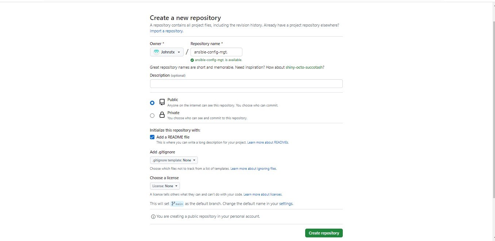

3. Install **Ansible**

```
sudo apt update

sudo apt install ansible
```
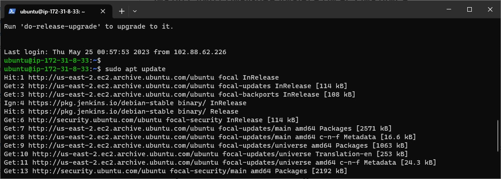

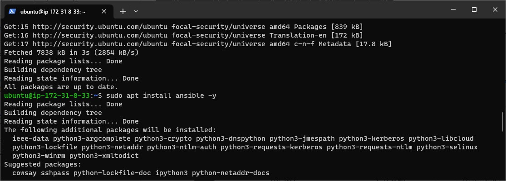

Check Ansible version by running `` ansible --version `` 
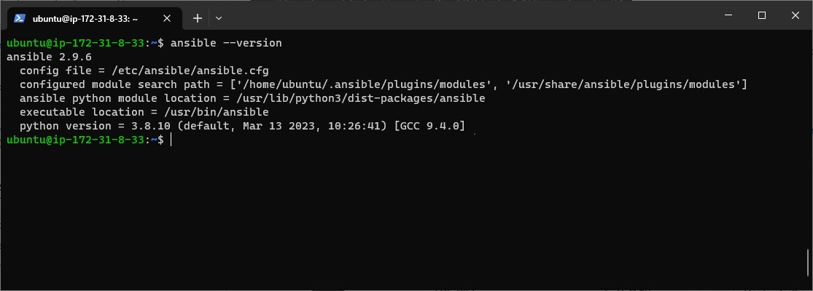

4. Configure Jenkins build job to save ``GitHub`` repository content every time it is changed/edited.

- Create a new Freestyle project``ansible`` in Jenkins and point it to the ‘ansible-config-mgt’ repository.

- Configure Webhook in GitHub and set webhook to trigger ``ansible`` build.
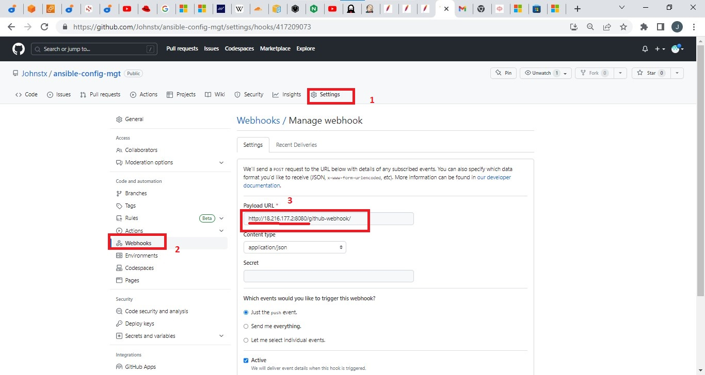

- Configure a Post-build job to save all (``**``) files.


5. Test this setup by making some change in README.MD file in main branch and ensure builds start automatically and Jenkins saves the files (build artifacts) in following folder

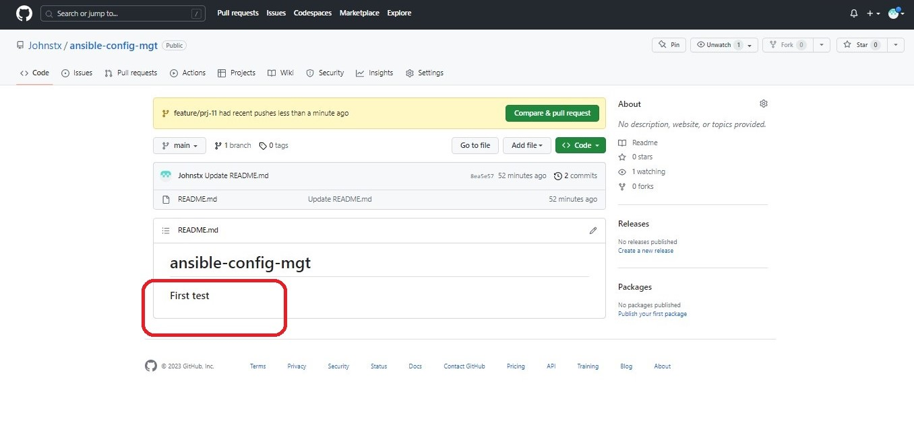

```
ls /var/lib/jenkins/jobs/ansible/builds/<build_number>/archive/
```
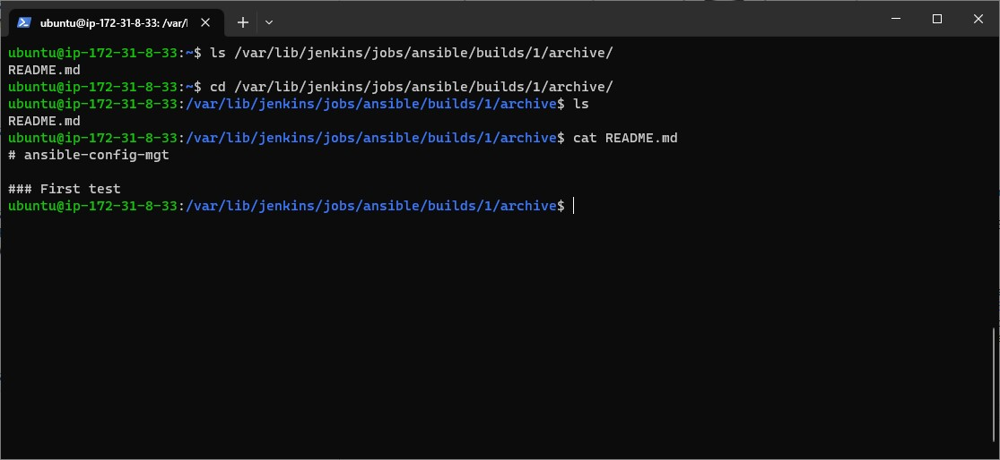

**Note**: Trigger Jenkins project execution only for /main branch.

The Setup now looks like this


**Tip** Every time you stop/start your ``Jenkins-Ansible`` server – you have to reconfigure GitHub webhook to a new IP address, in order to avoid it, it makes sense to allocate an [Elastic IP](https://docs.aws.amazon.com/AWSEC2/latest/UserGuide/elastic-ip-addresses-eip.html) to your ``Jenkins-Ansible`` server . Note that Elastic IP is free only when it is being allocated to an EC2 Instance, so do not forget to release Elastic IP once you terminate your EC2 Instance.

#### STEP 2 – PREPARE THE DEVELOPMENT ENVIRONMENT USING VS CODE

- [Visual Studio CODE (VS code)](https://en.wikipedia.org/wiki/Visual_Studio_Code)  is an [integrated development environment IDE](https://en.wikipedia.org/wiki/Integrated_development_environment) or [source code editor](https://en.wikipedia.org/wiki/Source-code_editor) for writing codes, debugging etc.

- After VS code download, configure it to [connect to the created GitHUb repository](https://www.dareyio.com/docs/install-and-configure-ansible-on-ec2-instance/www.youtube.com/watch?v=3Tn58KQvWtU&t).

- Clone ``ansible-config-mgt`` repo to your Jenkins-Ansible instance

```git clone <ansible-config-mgt repo link>```

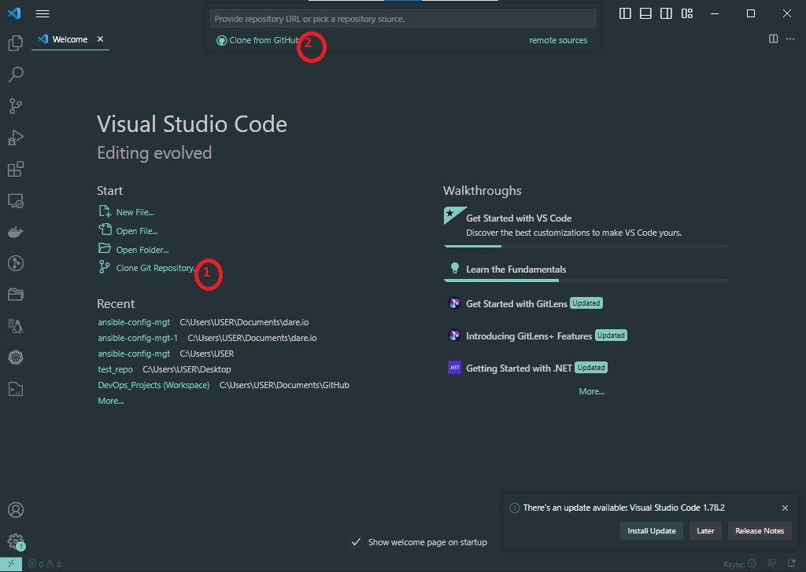

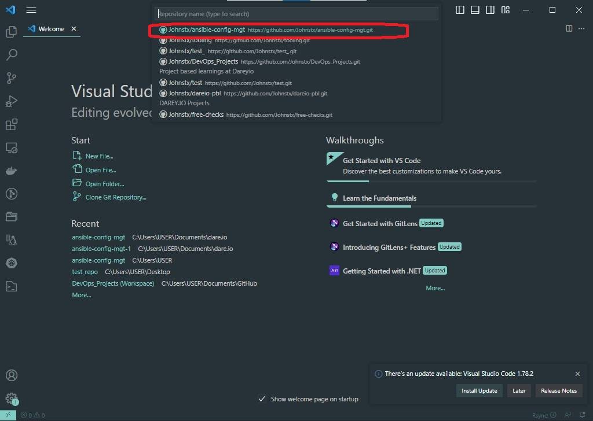

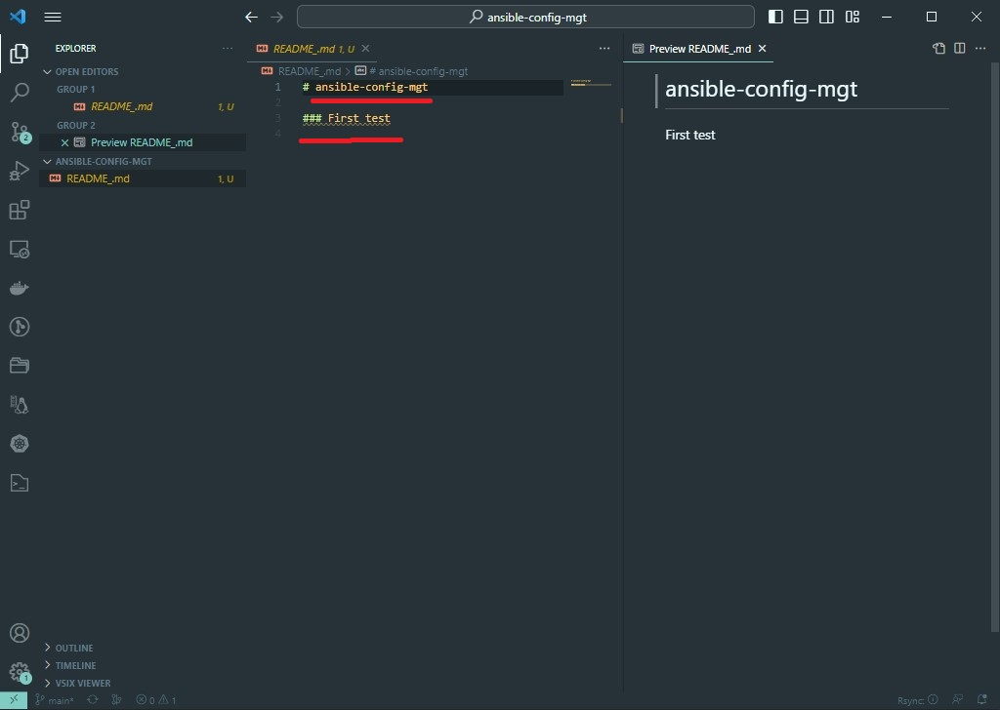
Now we have cloned the Repo successfully from GitHub.


### STEP 3 - ANSIBLE DEVELOPMENT

1. In ``ansible-config-mgt`` GitHub repository, create a new branch that will be used for development of a new feature.
e.g 
```
git checkout -b feature/prj-11
```
2. checkout to the new branch and build code and directory struture in this new branch.

3. Create directory ``playbooks`` - store all playbook files here.

4. Create a directory ``inventory``- organize all hosts here.

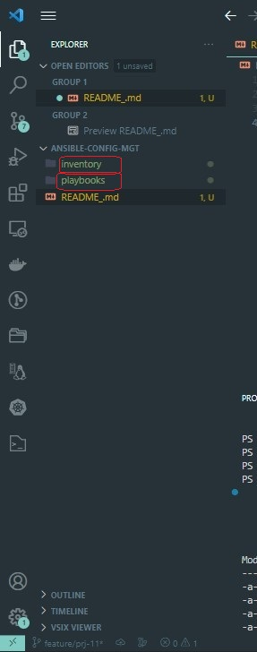

5. Inside the *playbooks* folder, create a playbook named ``common.yml`` 

6. Inside the *inventory* folder, create an inventory file (.yml) for each environment (Development, Staging Testing and Production)
``dev``, ``staging``, ``uat``, and ``prod`` respectively.
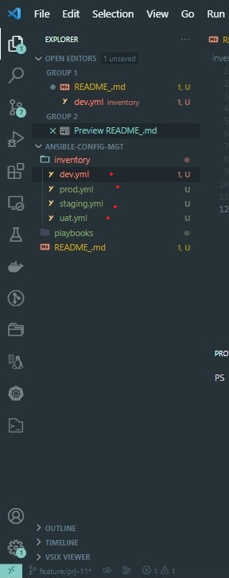

### STEP 4 - SET UP AN ANSIBLE INVENTORY

An Ansible inventory file defines the hosts and groups of hosts upon which commands, modules, and tasks in a playbook operate. Since our intention is to execute Linux commands on remote hosts, and ensure that it is the intended configuration on a particular server that occurs. It is important to have a way to organize our hosts in such an Inventory.

Save below inventory structure in the ``inventory/dev`` file to start configuring your *development* servers. Ensure to replace the IP addresses according to your own setup.


**Note**: Ansible uses TCP port 22 by default, which means it needs to ssh into target servers from ``Jenkins-Ansible`` host – for this you can implement the concept of [ssh-agent](https://smallstep.com/blog/ssh-agent-explained/#:~:text=ssh%2Dagent%20is%20a%20key,you%20connect%20to%20a%20server.&text=It%20doesn't%20allow%20your%20private%20keys%20to%20be%20exported.). Now you need to import your key into ``ssh-agent``:

To learn how to setup SSH agent and connect VS Code to your Jenkins-Ansible instance, please see this video:

- For Windows users – [ssh-agent on windows](https://youtu.be/OplGrY74qog)
- For Linux users – [ssh-agent on linux](https://youtu.be/OplGrY74qog)

```
eval `ssh-agent -s`
ssh-add <path-to-private-key>
```
Confirm the key has been added with the command below, you should see the name of your key


```
ssh-add -l
```

ssh into your ``Jenkins-Ansible`` server using ssh-agent

```
ssh -A ubuntu@public-ip
```
Tips:

*User* for Ubuntu servers - ``ubuntu``

*User* for RHEL-based servers - ``ec2-user``

Update your ``inventory/dev.yml`` file with this snippet of code:

```
[nfs]
<NFS-Server-Private-IP-Address> ansible_ssh_user='ec2-user'

[webservers]
<Web-Server1-Private-IP-Address> ansible_ssh_user='ec2-user'
<Web-Server2-Private-IP-Address> ansible_ssh_user='ec2-user'

[db]
<Database-Private-IP-Address> ansible_ssh_user='ec2-user' 

[lb]
<Load-Balancer-Private-IP-Address> ansible_ssh_user='ubuntu'
```


#### STEP 5 - CREATE A COMMON PLABOOK

In creating the first playbook, we will give some instructions to Ansible on what to be performed on all servers listed in the ``inventory/dev``.

In ``common.yml`` playbook you will write configuration for repeatable, re-usable, and multi-machine tasks that is common to systems within the infrastructure.

Update the ``playbooks/common.yml`` with the following code:


```
---
- name: update web, nfs and db servers
  hosts: webservers, nfs, db
  remote_user: ec2-user
  become: yes
  become_user: root
  tasks:
    - name: ensure wireshark is at the latest version
      yum:
        name: wireshark
        state: latest

- name: update LB server
  hosts: lb
  remote_user: ubuntu
  become: yes
  become_user: root
  tasks:
    - name: Update apt repo
      apt: 
        update_cache: yes

    - name: ensure wireshark is at the latest version
      apt:
        name: wireshark
        state: latest
```
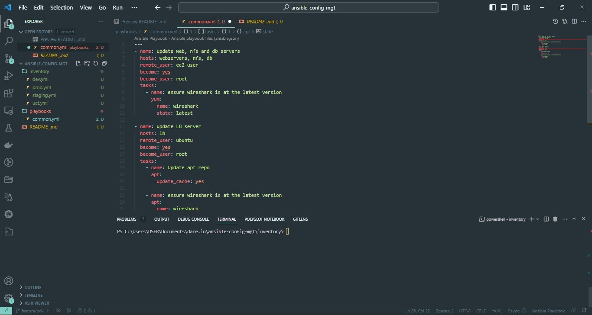

The code above performs basicall the same task - ``wireshark install``  in two differents host groups -- ``RHEL & Ubuntu``, uses ``root`` to action this task and respective package manager: ``yum`` for RHEL 8 and ``apt`` for Ubuntu.

For a better understanding of Ansible playbooks – [watch this video from RedHat](https://youtu.be/ZAdJ7CdN7DY) and read [this article.](https://www.redhat.com/en/topics/automation/what-is-an-ansible-playbook)


### STEP  6 – UPDATE GIT WITH THE LATEST CODE

Commit code into GitHub:

1. use git commands to add, commit and push your branch to GitHub.

```
git status

git add <selected files>

git commit -m "commit message"
```

2. Create a Pull request (PR)

3. Wear a hat of another developer for a second, and act as a reviewer
4. If the reviewer is happy with your new feature development, merge the code to the ``main`` branch.

5. Head back on your terminal, checkout from the feature branch into the ``main``, and pull down the latest changes.


Once your code changes appear in ``main`` branch – Jenkins will do its job and save all the files (build artifacts) to ``/var/lib/jenkins/jobs/ansible/builds/<build_number>/archive``/ directory on ``Jenkins-Ansible`` server. 

### STEP 7 - RUN FIRST ANSIBLE TEST

Lets execute ``ansible-plabook`` command and verify that the playbook actually works:
On the ``jenkins-ansible`` terminal - 

```
cd ansible-config-mgt
```

```
ansible-playbook -i inventory/dev.yml playbooks/common.yml
```

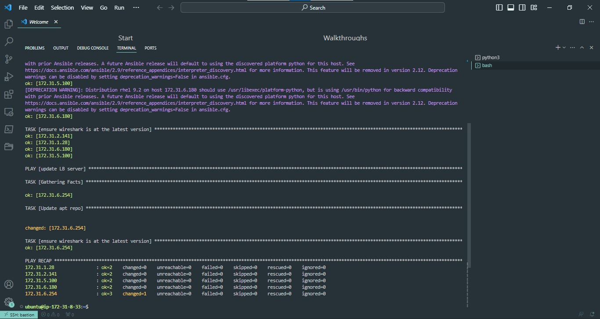

You can go to each of the servers and check if ``wireshark`` has been installed by running ``which wireshark`` or ``wireshark --version``

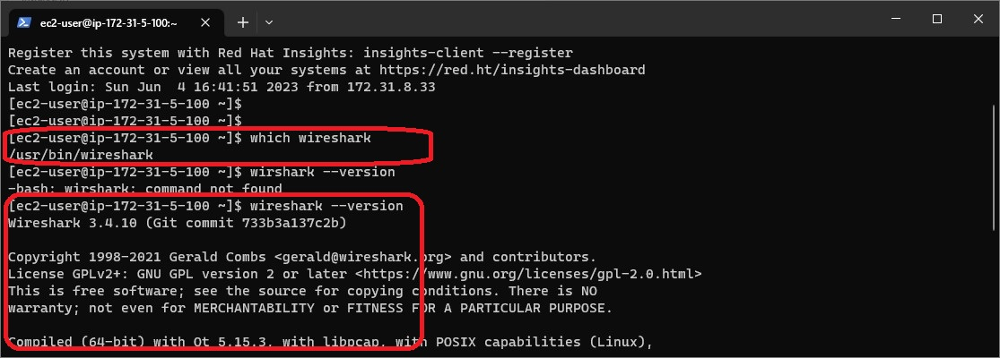


This update with Ansible architecture now looks like this:

