### 12 - ANSIBLE REFACTORING AND STATIC ASSIGNMENTS

This project is  a continution from Project 11. Here refactoring of the playbooks on the previous playbooks will be tested and run successfully.

#### STEP 1 - JENKINS JOB ENHANCEMENT

Before we begin, let us make some changes to our Jenkins job – now every new change in the codes creates a separate directory which is not very convenient when we want to run some commands from one place. Besides, it consumes space on Jenkins serves with each subsequent change. Let us enhance it by introducing a new Jenkins project/job – we will require [Copy Artifact](https://plugins.jenkins.io/copyartifact/) plugin.


1. Go to your ``Jenkins-Ansible`` server and create a new directory called ``ansible-config-artifact`` – we will store there all artifacts after each build.

```
sudo mkdir /home/ubuntu/ansible-config-artifact
```

2. Change permissions to this directory, so Jenkins could save files there – 
``chmod -R 0777 /home/ubuntu/ansible-config-artifact``

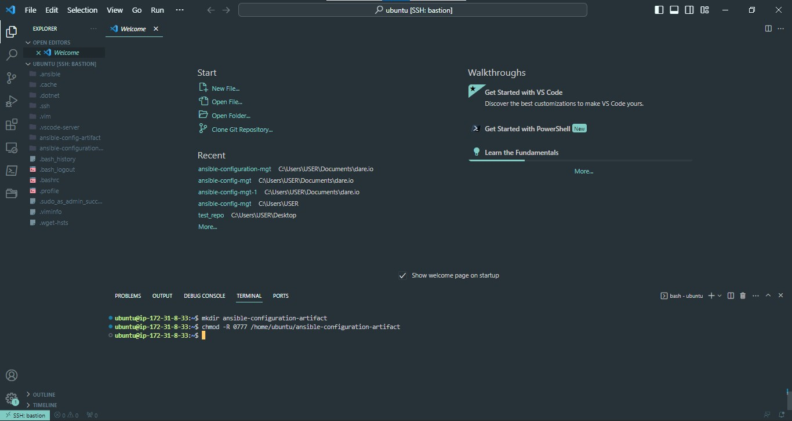

3. Go to Jenkins web console -> Manage Jenkins -> Manage Plugins -> on ``Available`` tab search for ``Copy Artifact`` and install this plugin without restarting Jenkins

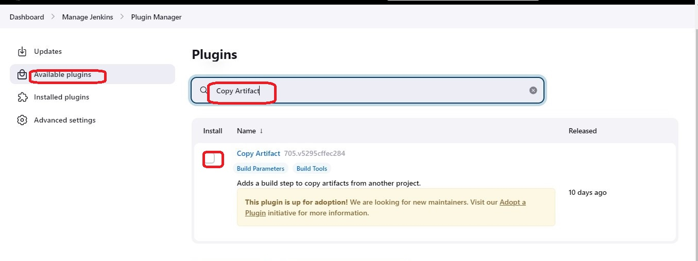

4. Create  a new freestyle project named - ``save_artifacts`` 

5. This project will be triggered by completion of your existing ``ansible`` project. Configure it accordingly:

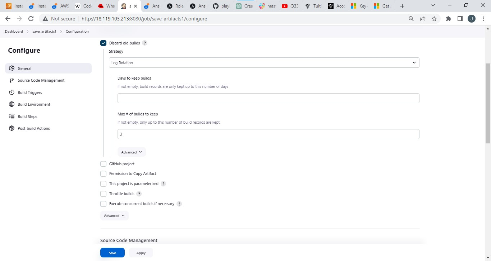

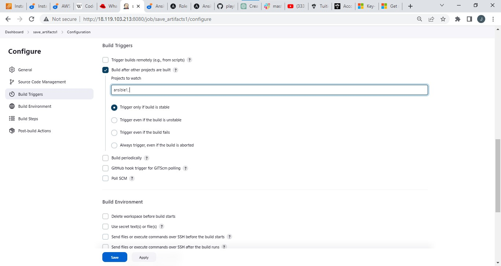


**Note**: You can configure number of builds to keep in order to save space on the server, for example, you might want to keep only last 2 or 5 build results. You can also make this change to your ``ansible`` job.

6. The main idea of ``save_artifacts ``project is to save artifacts into ``/home/ubuntu/ansible-config-artifact`` directory. To achieve this, create a Build step and choose ``Copy artifacts from other project``, specify ``ansible`` as a source project and ``/home/ubuntu/ansible-config-artifact`` as a target directory.


7. Test your set up by making some change in README.MD file inside your ``ansible-config-mgt`` repository (right inside main branch). 


If both Jenkins jobs have completed one after another – you shall see your files inside ``/home/ubuntu/ansible-config-artifact`` directory and it will be updated with every commit to your`` main `` branch.
e.g as seen below

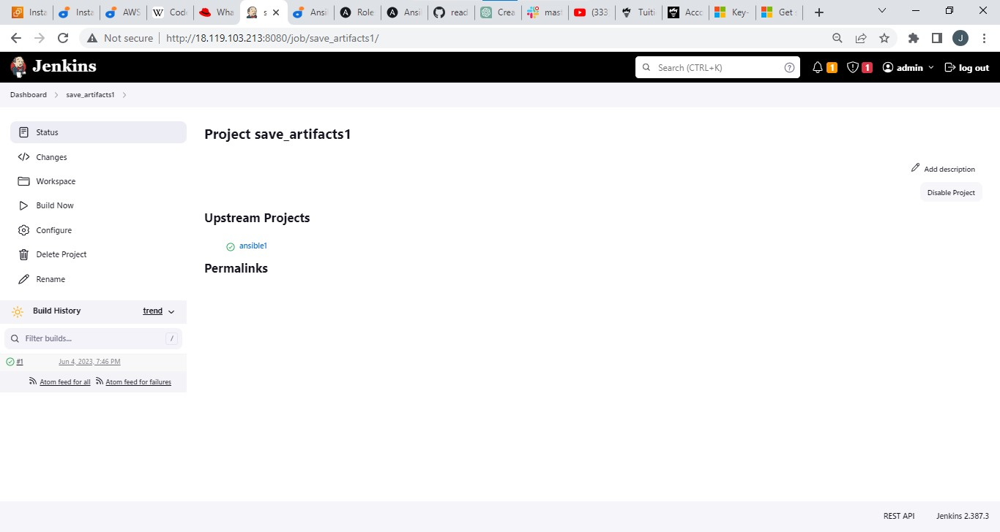
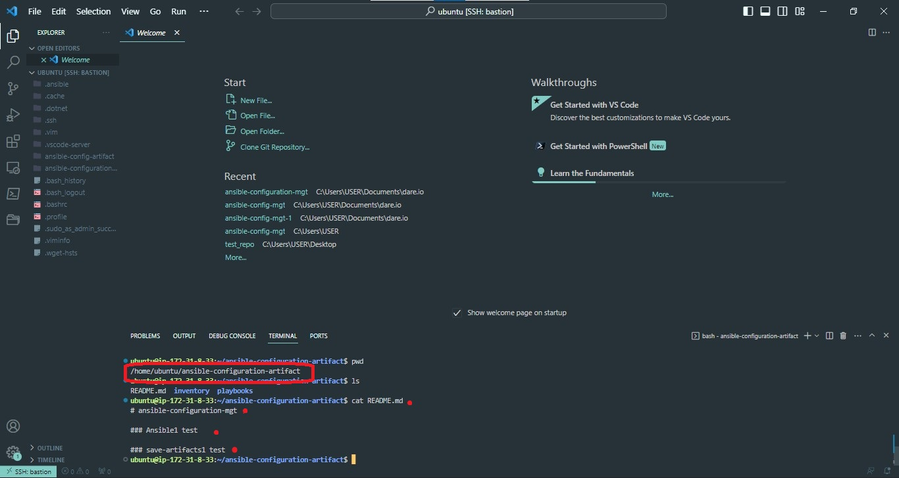

This makes the pipeline neat and clean

#### STEP 2 - REFACTOR ANSIBLE CODE BY IMPORTING OTHER PLAYBOOKS INTO SITE.YML

Before starting to refactor the codes, ensure that you have pulled down the latest code from ``main ``branch, and created a new branch, name it refactor

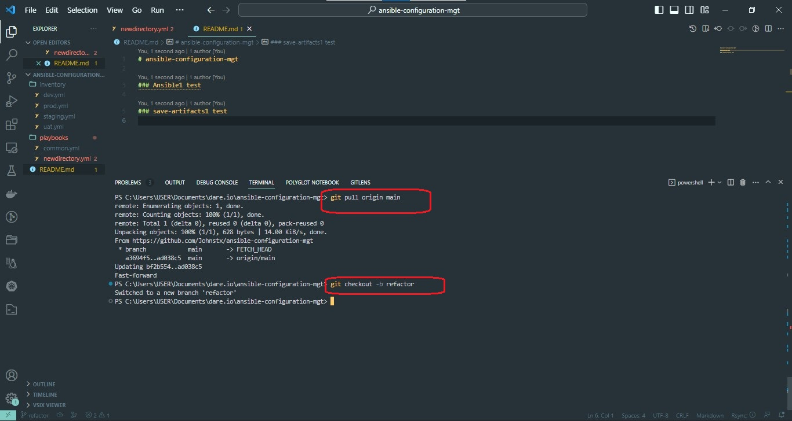


1. Within playbooks folder, create a new file and name it site.yml – This file will now be considered as an entry point into the entire infrastructure configuration. Other playbooks will be included here as a reference. In other words, ``site.yml`` will become a parent to all other playbooks that will be developed. Including ``common.yml`` that was created previously.

2. Create a new folder in root of the repository and name it ``static-assignments``. The **static-assignments**folder is where all other children playbooks will be stored. This is merely for easy organization of your work. It is not an Ansible specific concept, therefore you can choose how you want to organize your work. 

3. Move`` common.yml`` file into the newly created ``static-assignments`` folder.

4. Inside ``site.yml`` file, import ``common.yml`` playbook.

```
---
- hosts: all
- import_playbook: ../static-assignments/common.yml
```

The code above uses built in [import_playbook Ansible](https://docs.ansible.com/ansible/latest/collections/ansible/builtin/import_playbook_module.html) module.

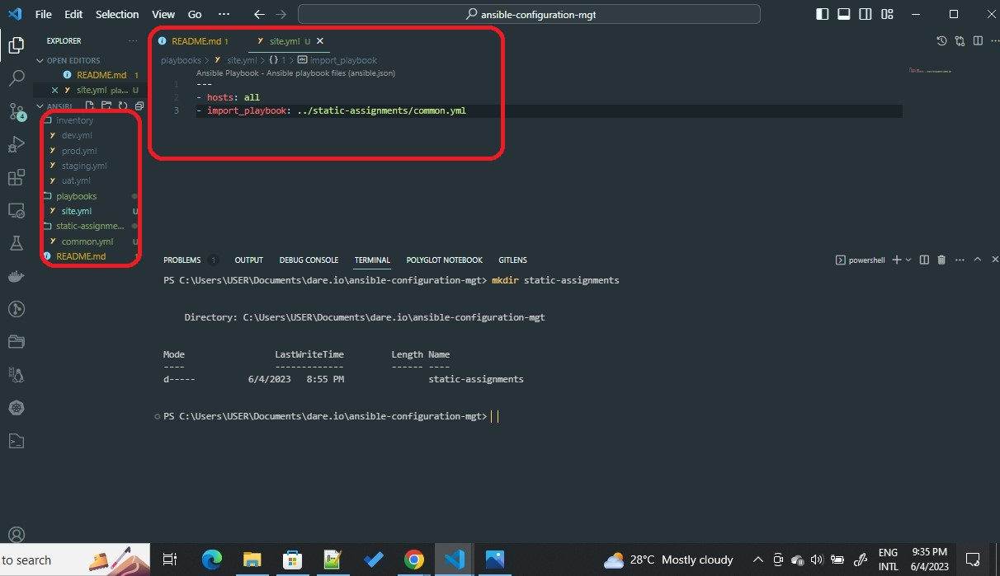

Your folder structure should look like this;
```
├── static-assignments
│   └── common.yml
├── inventory
    └── dev
    └── stage
    └── uat
    └── prod
└── playbooks
    └── site.yml
```

5. Run ``ansible-playbook`` command against the ``dev`` environment

Since you need to apply some tasks to your ``dev`` servers and ``wireshar``k is already installed – you can go ahead and create another playbook under ``static-assignments`` and name it ``common-del.yml``. In this playbook, configure deletion of ``wireshark`` utility.

```
---
- name: update web, nfs and db servers
  hosts: webservers, nfs, db
  remote_user: ec2-user
  become: yes
  become_user: root
  tasks:
  - name: delete wireshark
    yum:
      name: wireshark
      state: removed

- name: update LB server
  hosts: lb
  remote_user: ubuntu
  become: yes
  become_user: root
  tasks:
  - name: delete wireshark
    apt:
      name: wireshark-qt
      state: absent
      autoremove: yes
      purge: yes
      autoclean: yes
```

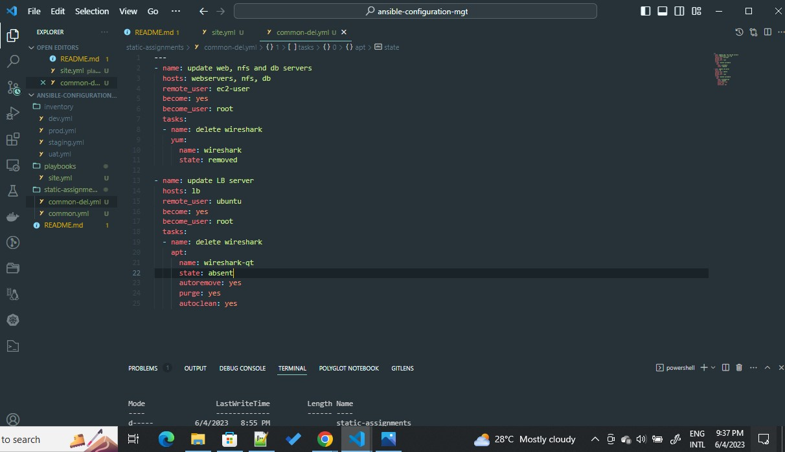

update ``site.yml`` with
``- import_playbook: ../static-assignments/common-del.yml `` instead of ``common.yml`` and tun it against ``dev`` servers:

```
cd /home/ubuntu/ansible-config-mgt/

ansible-playbook -i inventory/dev.yml playbooks/site.yml
```


Ensure build is successful...
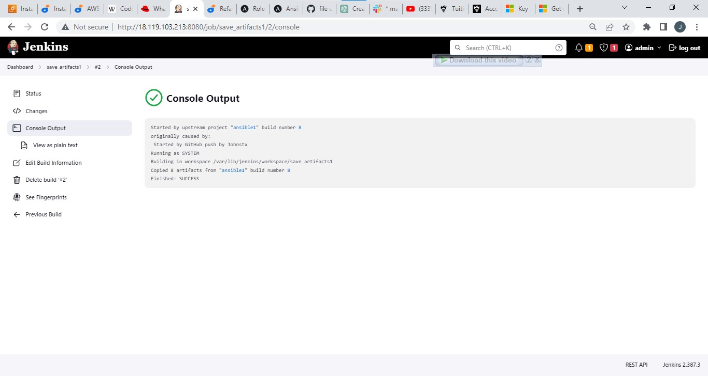
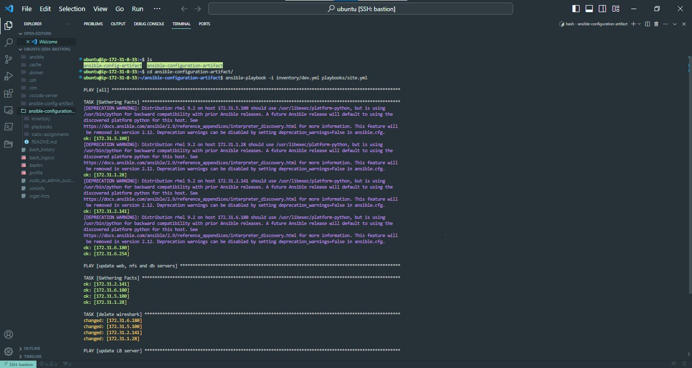


...and that wireshark is deleted on all the servers by running wireshark --version

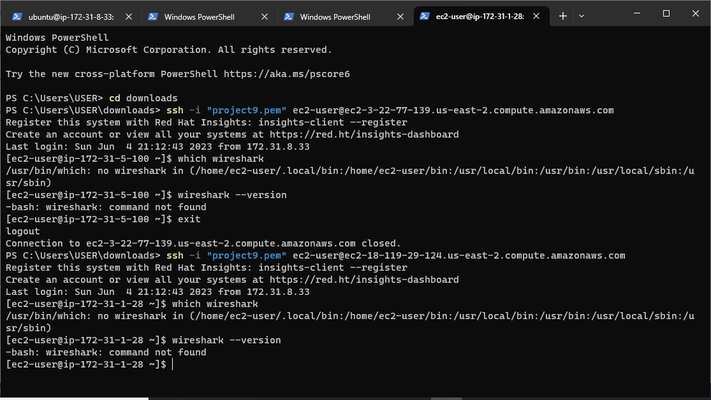
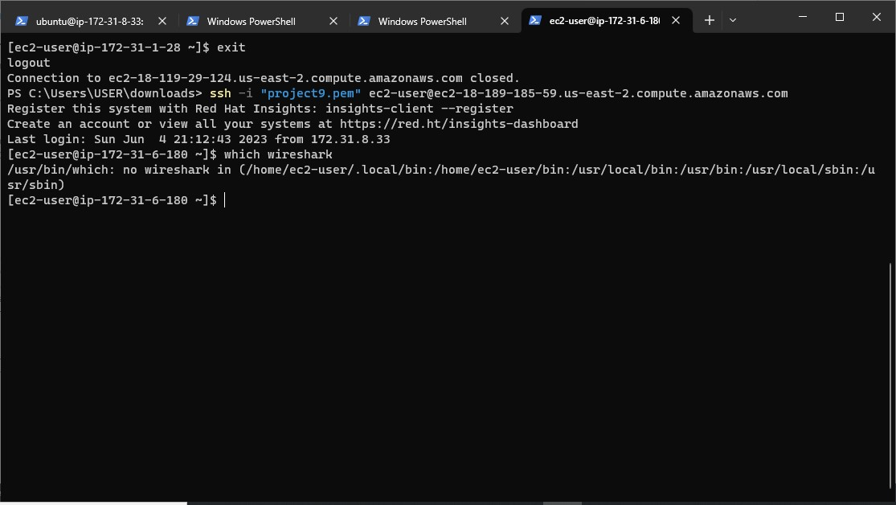

We have successfully used ``import_playbooks`` module and have a solution to install/delete packages on multiple servers with just one command.

### STEP 3 CONFIGURE UAT WEBSERVERS WITH A ROLE ‘WEBSERVER’.

We have our nice and clean dev environment, so let us put it aside and configure 2 new Web Servers as uat. We could write tasks to configure Web Servers in the same playbook, but it would be too messy, instead, we will use a dedicated role to make our configuration reusable.

1. Launch 2 fresh EC2 instances using RHEL 8 image, we will use them as our ``uat`` servers, so give them names accordingly – ``Web1-UAT`` and ``Web2-UAT``.

**Tip**: Do not forget to stop EC2 instances that you are not using at the moment to avoid paying extra. For now, you only need 2 new RHEL 8 servers as Web Servers and 1 existing ``Jenkins-Ansible`` server up and running

2. To create a role, you must create a directory called ``roles/``, relative to the playbook file or in ``/etc/ansible/`` directory.

There are two ways how you can create this folder structure:

- Use an Ansible utility called ``ansible-galaxy`` inside ``ansible-config-mgt/roles `` directory (you need to create ``roles`` directory upfront)

```
mkdir roles
cd roles
ansible-galaxy init webserver
```
- Create the directory/files structure manually

For now we will create roles using the manual option.


```
└── webserver
    ├── README.md
    ├── defaults
    │   └── main.yml
    ├── handlers
    │   └── main.yml
    ├── meta
    │   └── main.yml
    ├── tasks
    │   └── main.yml
    └── templates
```
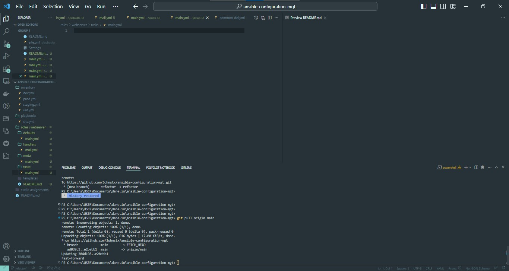

3. Update your inventory ``ansible-config-mgt/inventory/uat.yml`` file with IP addresses of your 2 UAT Web servers

**NOTE:** Ensure you are using ssh-agent to ssh into the Jenkins-Ansible instance just as you have done in project 11;

```
[uat-webservers]
<Web1-UAT-Server-Private-IP-Address> ansible_ssh_user='ec2-user' 

<Web2-UAT-Server-Private-IP-Address> ansible_ssh_user='ec2-user' 
```
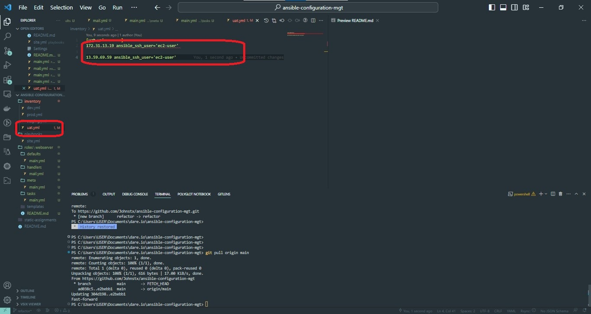

4. In ``/etc/ansible/ansible.cfg ``file uncomment ``roles_path`` string and provide a full path to your roles directory ``roles_path    = /home/ubuntu/ansible-config-mgt/roles``, so Ansible could know where to find configured roles.

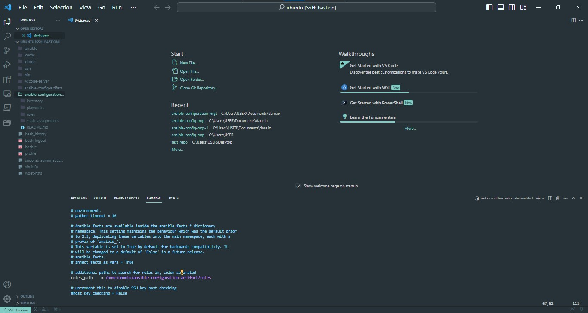

5. It is time to start adding some logic to the webserver role. Go into ``tasks`` directory, and within the ``main.yml`` file, start writing configuration tasks to do the following:

- Install and configure Apache (``httpd`` service)
- Clone **Tooling website** from GitHub ``https://github.com/<your-name>/tooling.git.``
- Ensure the tooling website code is deployed to ``/var/www/html`` on each of 2 UAT Web servers.
- Make sure ``httpd`` service is started

Your main.yml may consist of following tasks:

```
---
- name: install apache
  become: true
  ansible.builtin.yum:
    name: "httpd"
    state: present

- name: install git
  become: true
  ansible.builtin.yum:
    name: "git"
    state: present

- name: clone a repo
  become: true
  ansible.builtin.git:
    repo: https://github.com/<your-name>/tooling.git
    dest: /var/www/html
    force: yes

- name: copy html content to one level up
  become: true
  command: cp -r /var/www/html/html/ /var/www/

- name: Start service httpd, if not started
  become: true
  ansible.builtin.service:
    name: httpd
    state: started

- name: recursively remove /var/www/html/html/ directory
  become: true
  ansible.builtin.file:
    path: /var/www/html/html
    state: absent
```

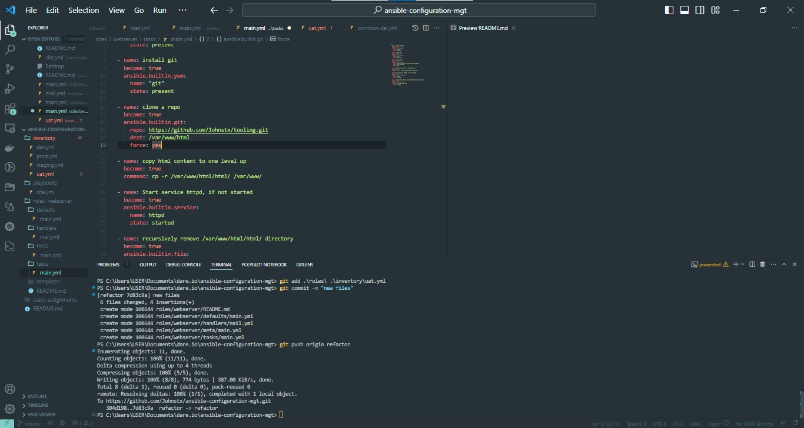


### STEP 4 - REFERENCE WEBSERVER ROLE

Within the ``static-assignments`` folder, create a new assignment for **uat-webservers** **uat-webservers.yml**. This is where you will reference the role.


```
---
- hosts: uat-webservers
  roles:
     - webserver
```

Remember that the entry point to our ansible configuration is the ``site.yml`` file. Therefore, you need to refer your ``uat-webservers.yml`` role inside ``site.yml``.

So, we should have this in ``site.yml``

```
---
- hosts: all
- import_playbook: ../static-assignments/common.yml

- hosts: uat-webservers
- import_playbook: ../static-assignments/uat-webservers.yml
```

### Step 5 – Commit & Test

Commit your changes, create a Pull Request and merge them to ``main`` branch, make sure webhook triggered two consequent Jenkins jobs, they ran successfully and copied all the files to your ``Jenkins-Ansible`` server into ``/home/ubuntu/ansible-config-mgt/`` directory.

Now run the playbook against your ``uat`` inventory and see what happens:

```
sudo ansible-playbook -i /home/ubuntu/ansible-config-mgt/inventory/uat.yml /home/ubuntu/ansible-config-mgt/playbooks/site.yml
```
You should be able to see both of your UAT Web servers configured and you can try to reach them from your browser:
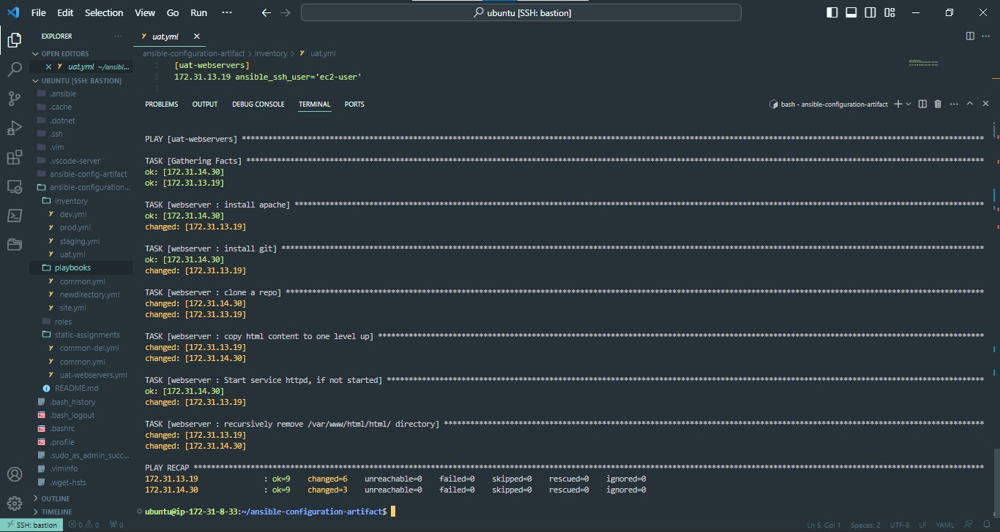


We have just learned how to deploy and configure UAT Web Servers using Ansible imports and roles

