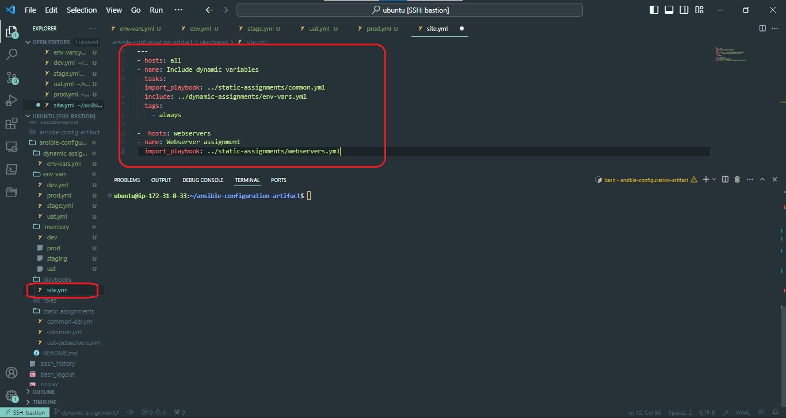
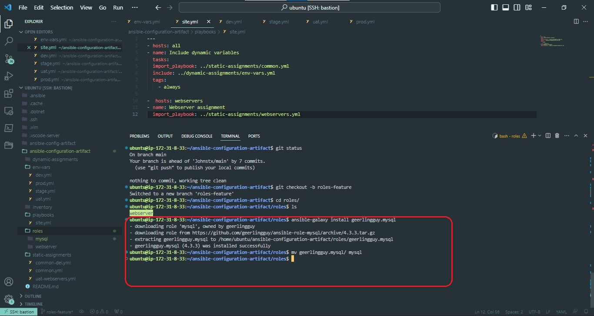
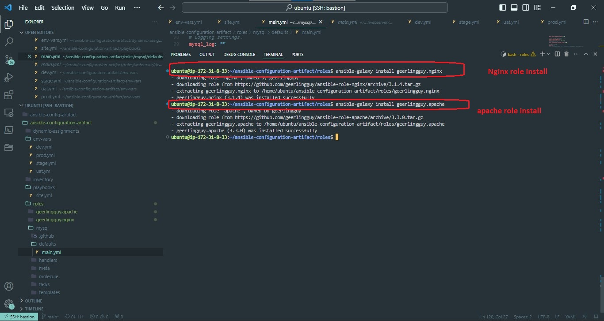
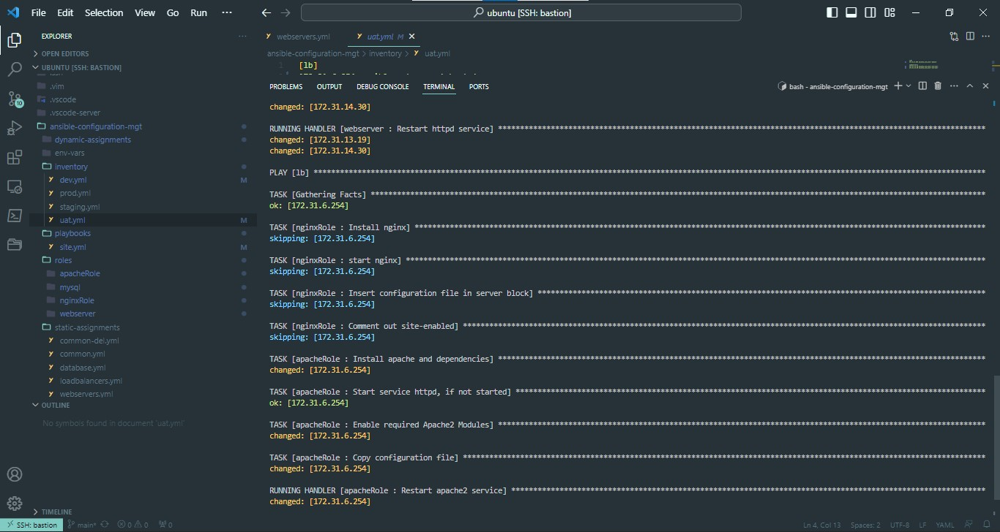
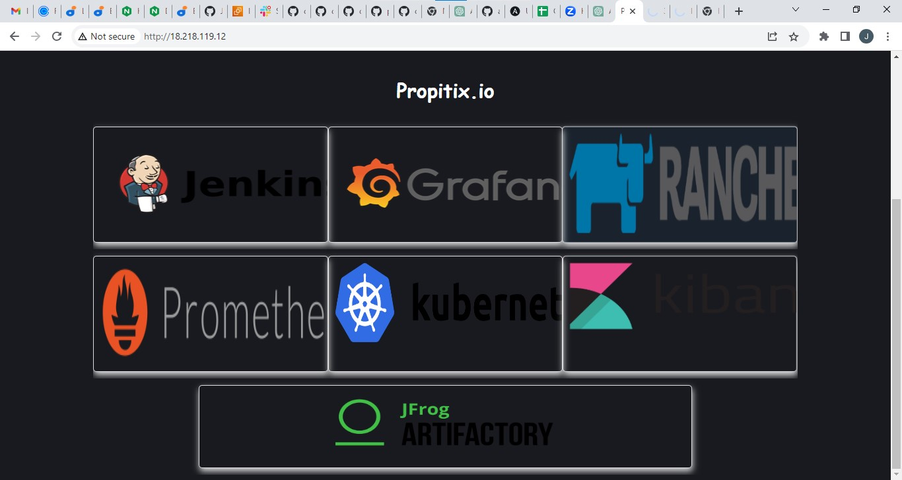

### PROJECT 13 ANSIBLE DYNAMIC ASSIGNMENTS (INCLUDE) AND COMMUNITY ROLES

#### STEP 1 - INTRODUCING DYNAMIC ASSIGNMENT INTO OUR STRUCTURE

In your`` https://github.com/<your-name>/ansible-config-mgt `` GitHub repository start a new branch and call it ``dynamic-assignments``.

Create a new folder, name it ``dynamic-assignments``. Then inside this folder, create a new file and name it ``env-vars.yml``. We will instruct`` site.yml`` to ``include`` this playbook later. For now, let us keep building up the structure.

Your GitHub should have following structure by now.

```
├── dynamic-assignments
│   └── env-vars.yml
├── inventory
│   └── dev
    └── stage
    └── uat
    └── prod
└── playbooks
    └── site.yml
└── roles (optional folder)
    └──...(optional subfolders & files)
└── static-assignments
    └── common.yml
```

Since we will be using the same Ansible to configure multiple environments, and each of these environments will have certain unique attributes, such as **servername**, **ip-address** etc., we will need a way to set values to variables per specific environment.

For this reason, we will now create a folder to keep each environment’s variables file. Therefore, create a new folder ``env-vars``, then for each environment, create new **YAML** files which we will use to set variables.

Your layout should now look like this.

```
├── dynamic-assignments
│   └── env-vars.yml
├── env-vars
    └── dev.yml
    └── stage.yml
    └── uat.yml
    └── prod.yml
├── inventory
    └── dev
    └── stage
    └── uat
    └── prod
├── playbooks
    └── site.yml
└── static-assignments
    └── common.yml
    └── webservers.yml
```

Now paste the instruction below into the ``env-vars.yml`` file.

```
---
- name: collate variables from env specific file, if it exists
  hosts: all
  tasks:
    - name: looping through list of available files
      include_vars: "{{ item }}"
      with_first_found:
        - files:
            - dev.yml
            - stage.yml
            - prod.yml
            - uat.yml
          paths:
            - "{{ playbook_dir }}/../env-vars"
      tags:
        - always
```
Notice 3 things to notice here:

We used ``include_vars`` syntax instead of ``include``, this is because Ansible developers decided to separate different features of the module. From Ansible version 2.8, the ``include`` module is deprecated and variants of ``include_*`` must be used. These are:

- [include_role](https://docs.ansible.com/ansible/latest/collections/ansible/builtin/include_role_module.html#include-role-module)
- [include_tasks](https://docs.ansible.com/ansible/latest/collections/ansible/builtin/include_tasks_module.html#include-tasks-module)
- [include_vars](https://docs.ansible.com/ansible/latest/collections/ansible/builtin/include_vars_module.html#include-vars-module)

In the same version, variants of **import** were also introduces, such as:

- [import_role](https://docs.ansible.com/ansible/latest/collections/ansible/builtin/import_role_module.html#import-role-module)
- [import_tasks](https://docs.ansible.com/ansible/latest/collections/ansible/builtin/import_tasks_module.html#import-tasks-module)

2. We made use of a [special variables](https://docs.ansible.com/ansible/latest/reference_appendices/special_variables.html) ``{ playbook_dir }`` and ``{ inventory_file }``. ``{ playbook_dir }`` will help Ansible to determine the location of the running playbook, and from there navigate to other path on the filesystem. ``{ inventory_file }`` on the other hand will dynamically resolve to the name of the inventory file being used, then append ``.yml`` so that it picks up the required file within the ``env-vars`` folder.
We are including the variables using a loop. ``with_first_found`` implies that, looping through the list of files, the first one found is used. This is good so that we can always set default values in case an environment specific env file does not exist.

#### STEP - 2 UPDATE SITE.YML WITH DYNAMIC ASSIGNMENTS

1. Update ``site.yml`` file to make use of the dynamic assignment.

**site.yml** should look like this

```
---
- hosts: all
- name: Include dynamic variables 
  tasks:
  import_playbook: ../static-assignments/common.yml 
  include: ../dynamic-assignments/env-vars.yml
  tags:
    - always

-  hosts: webservers
- name: Webserver assignment
  import_playbook: ../static-assignments/webservers.yml
```



2. Community Roles
Create a role for MySQL database, this role will -
- install MySQL package
- Create a database and configure users.
Roles wil be downloaded with [Ansible Galaxy](https://galaxy.ansible.com/home), where available community roles can be found.

We will use [MySQLrole developed by geerlingguy](https://galaxy.ansible.com/geerlingguy/mysql)


**Hint**: To preserve your your GitHub in actual state after you install a new role – make a commit and push to master your ‘ansible-config-mgt’ directory. Of course you must have **git** installed and configured on **Jenkins-Ansible** server and, for more convenient work with codes, you can configure Visual Studio Code to work with this directory. In this case, you will no longer need webhook and Jenkins jobs to update your codes on **Jenkins-Ansible** server, so you can disable it – we will be using Jenkins later for a better purpose.

On **Jenkins-Ansible** server make sure that **git** is installed with **git --version**, then go to ‘ansible-config-mgt’ directory and run

```
git init
git pull https://github.com/<your-name>/ansible-config-mgt.git
git remote add origin https://github.com/<your-name>/ansible-config-mgt.git
git branch roles-feature
git switch roles-feature

```



Inside ``roles`` directory create your new MySQL role with ``ansible-galaxy install geerlingguy.mysql`` and rename the folder to ``mysql``

```
mv geerlingguy.mysql/ mysql
```

Read ``README.md`` file, and edit roles configuration to use correct credentials for MySQL required for the ``tooling`` website.

Now it is time to upload the changes into your GitHub

```
git add .
git commit -m "Commit new role files into GitHub"
git push --set-upstream origin roles-feature
```

Now, if you are satisfied with your codes, you can create a Pull Request and merge it to ``main`` branch on GitHub.

#### STEP 3 - LOAD BALANCER ROLES

We want to be able to switch use between 2 load balancers - ``Nginx`` and ``Apache``, so we need to download the roles - 
1. Nginx
2. Apache



- Update both ``static-assignment`` and ``site.yml`` files to refer the roles

- Declare a variable in ``defaults/main.yml`` file inside the Nginx and Apache roles. Name each variables ``enable_nginx_lb`` and ``enable_apache_lb`` respectively.
- Set both values to false like this ``enable_nginx_lb: false`` and ``enable_apache_lb: false``.
- Declare another variable in both roles ``load_balancer_is_required`` and set its value to ``false`` as well
- Update both assignment and site.yml files respectively

``loadbalancers.yml`` file

```
- hosts: lb
  roles:
    - { role: nginx, when: enable_nginx_lb and load_balancer_is_required }
    - { role: apache, when: enable_apache_lb and load_balancer_is_required }
```

``site.yml`` file

```
     - name: Loadbalancers assignment
       hosts: lb
         - import_playbook: ../static-assignments/loadbalancers.yml
        when: load_balancer_is_required 
```

Now you can make use of ``env-vars\uat.yml`` file to define which loadbalancer to use in UAT environment by setting respective environmental variable to ``true``.

You will activate load balancer, and enable ``nginx`` by setting these in the respective environment’s env-vars file.

```
enable_nginx_lb: true
load_balancer_is_required: true
```


The same must work with ``apache`` LB, so you can switch it by setting respective environmental variable to ``true`` and other to ``false``.

To test this, you can update inventory for each environment and run Ansible against each environment.




Nginx as the load balancer

