### PROJECT 14

#### EXPERIENCE CONTINUOUS INTEGRATION WITH JENKINS | ANSIBLE | ARTIFACTORY | SONARQUBE | PHP

This Projects applies the entire concept around **CI/CD** from application perspective. To fully gain real expertsse around this idea, it is best to see it in action accross different programming languages and also from the platorm perspective - this entails working with platforms like [Terraform](https://www.terraform.io), [Docker](https://www.docker.com) and [Kubernetes](https://www.kubernetes.io).
For this application perspective, we will be focusing on **[PHP](https://en.wikipedia.org/wiki/PHP)**

As a prerequisite for this project, it is important to understand the entire CI/CD process, roles of each tool and success metrics so its important to familiarise self with the concept and the required tools.

To emphasize a typical CI Pipeline further, let us explore the diagram below a little deeper.


- **Version Control:** This is the stage where developers’ code gets committed and pushed after they have tested their work locally.

- **Build:** Depending on the type of language or technology used, we may need to build the codes into binary executable files (in case of compiled languages) or just package the codes together with all necessary dependencies into a deployable package (in case of interpreted languages).

- **Unit Test:** Unit tests that have been developed by the developers are tested. Depending on how the CI job is configured, the entire pipeline may fail if part of the tests fails, and developers will have to fix this failure before starting the pipeline again. 
**A Job**  is a phase in the pipeline. 
**Unit Test** is a phase, therefore it can be considered a job on its own.

- **Deploy:** Once the tests are passed, the next phase is to deploy the compiled or packaged code into an artifact repository. This is where all the various versions of code including the latest will be stored. The CI tool will have to pick up the code from this location to proceed with the remaining parts of the pipeline.

- **Auto Test:** Apart from Unit testing, there are many other kinds of tests that are required to analyse the quality of code and determine how vulnerable the software will be to external or internal attacks. These tests must be automated, and there can be multiple environments created to fulfil different test requirements. For example, a server dedicated for Integration Testing will have the code deployed there to conduct integration tests. Once that passes, there can be other sub-layers in the testing phase in which the code will be deployed to, so as to conduct further tests. Such are User Acceptance Testing (UAT), and another can be Penetration Testing. These servers will be named according to what they have been designed to do in those environments. A UAT server is generally be used for UAT, SIT server is for Systems Integration Testing, PEN Server is for Penetration Testing and they can be named whatever the naming style or convention in which the team is used. An environment does not necessarily have to reside on one single server. In most cases it might be a stack as you have defined in your Ansible Inventory. All the servers in the inventory/dev are considered as Dev Environment. The same goes for inventory/stage (Staging Environment) inventory/preprod (Pre-production environment), inventory/prod (Production environment), etc. So, it is all down to naming convention as agreed and used company or team wide.


- **Deploy to production:** Once all the tests have been conducted and either the release manager or whoever has the authority to authorize the release to the production server is happy, he gives green light to hit the deploy button to ship the release to production environment. This is an Ideal Continuous Delivery Pipeline. If the entire pipeline was automated and no human is required to manually give the Go decision, then this would be considered as Continuous Deployment. Because the cycle will be repeated, and every time there is a code commit and push, it causes the pipeline to trigger, and the loop continues over and over again.

- **Measure and Validate:** This is where live users are interacting with the application and feedback is being collected for further improvements and bug fixes

#### Principles of a reliable and robust **CI/CD**

- Maintain a code repository

- Automate build process

- Make builds self-tested

- Everyone commits to the baseline every day

- Every commit to baseline should be built

- Every bug-fix commit should come with a test case

- Keep the build fast

- Test in a clone of production environment

- Make it easy to get the latest deliverables

- Everyone can see the results of the latest build

- Automate deployment (if you are confident enough in your CI/CD pipeline and willing to go for a fully automated Continuous Deployment)


In this Project, I will simulate the CI/CD pipeline of a **PHP** based application. The process will look like diagram shown below


This Project will continue from **Project 13**, and will use the following 

Repos
- **Ansible configuration mgt** - Tooling app for deployement through Ansible. Jenkinsfile contains the roles that configures the architecture reqiured to run the application.
- **php-todo** - An application with *unit tests* that shows a CI/CD pipeline. Jenkinsfile  runs the CI/CD piepline for a PHP app.

Tools
- **Ansible**
- **Jenkins** 
- **J-frog artifactory** -  A binary repository manager that will be used to manage our build artifacts
- **Sonarqube** - For continous inspection of code quality.

Instances
- **RHEL 8** server (*t2 medium*) - for the jenkins & ansible
- **Ubuntu 20.04** - for the artifactory

Now lets begin

### STEP 0 - JENKINS SET-UP
- create a RHEL server named
```
jenkins-ansible
```

Add ssh keys to ssh agent to enable remote connection from vscode. 

``shh-add -k "keyname.pem"`` 

ssh into ``jenkins-ansible`` server, install git if not installed.

- import repo from github
``` 
git clone https://github.com/Johnstx/ansible-configuration-13.git 
```
- switch to *root user* and Install Jenkins


``` 
sudo su

yum install wget -y

wget -O /etc/yum.repos.d/jenkins.repo \
    https://pkg.jenkins.io/redhat-stable/jenkins.repo
rpm --import https://pkg.jenkins.io/redhat-stable/jenkins.io-2023.key

yum install -y https://dl.fedoraproject.org/pub/epel/epel-release-latest-8.noarch.rpm

yum install -y dnf-utils http://rpms.remirepo.net/enterprise/remi-release-8.rpm

 yum install java-11-openjdk-devel -y

```

*open the bash profile*
```
vi .bash_profile
```

paste the below in the bash profile

```
export JAVA_HOME=$(dirname 
(readlink 
(which javac))))) export PATH=$PATH:$JAVA_HOME/bin export CLASSPATH=.:$JAVA_HOME/jre/lib:$JAVA_HOME/lib:$JAVA_HOME/lib/tools.jar
```

reload the bash profile
```
source ~/.bash_profile
```
``exit`` the root *user*  and install Jenkins

```
sudo yum install jenkins
```

Guide to install jenkins [**here**](https://www.jenkins.io/doc/book/installing/)

Enable, start and check status of jenkins

```
sudo systemctl enable jenkins

sudo systemctl start jenkins

sudo systemctl status jenkins


sudo systemctl daemon-reload
```


 ### STEP 1
 CONFIGURING ANSIBLE FOR JENKINS DEPLOYMENT


In the previous projects, we launched ansible from the CLI but after this configuration, we will be able to run ansible from jenkins UI.

1. Open the Jenkins URL, install and open Blue ocean plugin
.jpg>)

2. create a new pipeline


3. Select Github
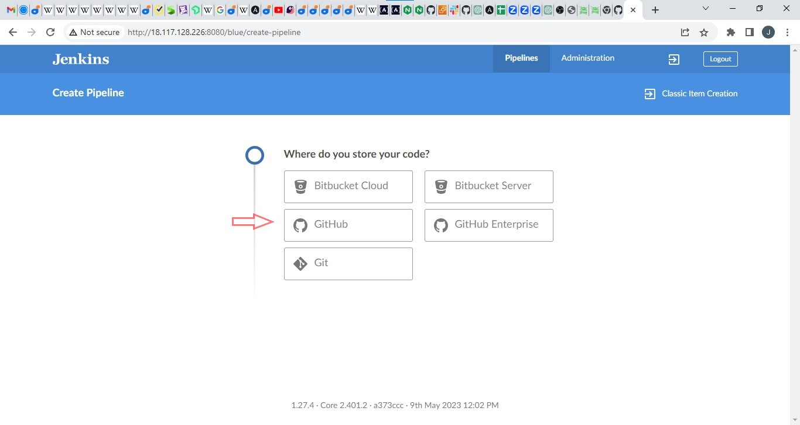

4. Connect Jenkins with Github
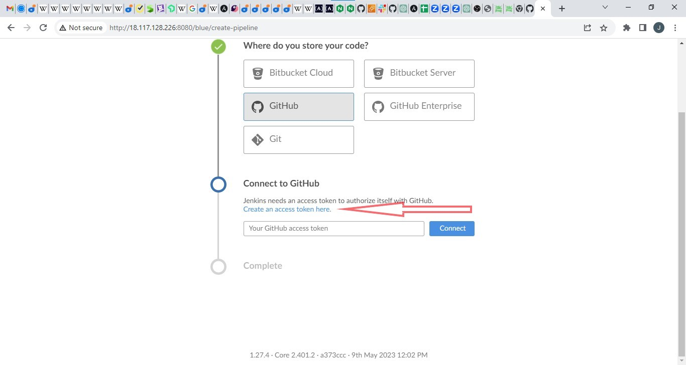

5. Login to GitHub & Generate an Access Token


6. Copy access token
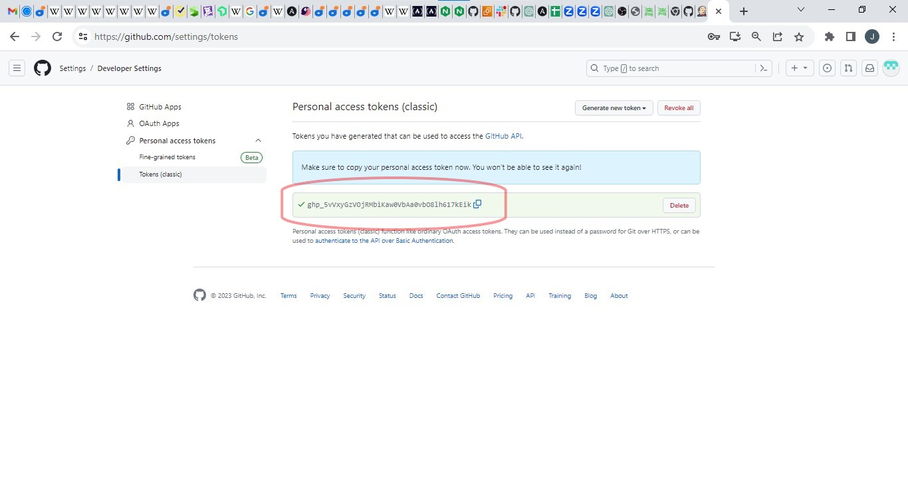

7. Paste the token in the jenkins UI and connect


8. Create a pipeline from github repo
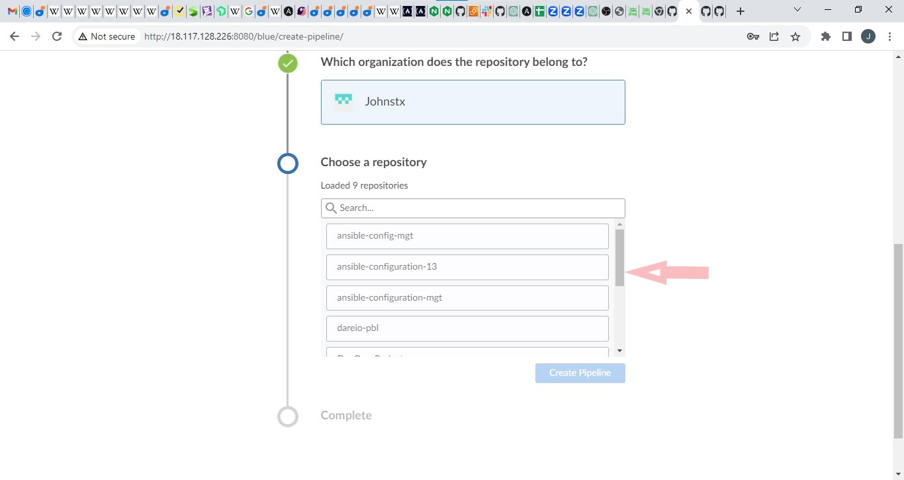


9. Exit from blue ocean by clicking on he administator tab


10. Created pipeline takes the name of the github repo that was selected earlier.
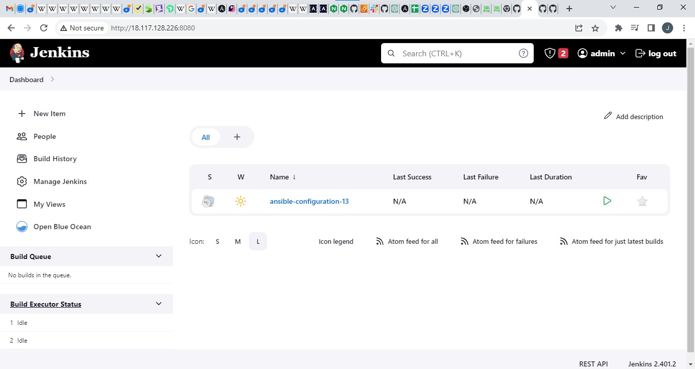


### STEP 2
CREATE A JENKINSFILE
All the tests I want to run will be stated as code in a ``jenkinsfile``.

- So, In the ansible repo, I will create a directory called ``deploy`` and create a  ``` jenkinsfile ``` inside the directory.
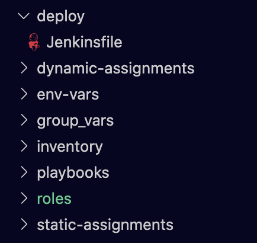

- The code snippet below is added into the jenkinsfile
```
pipeline {
    agent any


  stages {
    stage('Build') {
      steps {
        script {
          sh 'echo "Building Stage"'
        }
      }
    }
    }
}
```
This is a simple pipeline with a stage called ``build``, and using a ```shell script``` module to echo ```Building Stage```. Save, commit and push to the github repo


- CONFIGURE JENKINS TO RUN PIPELINE FROM THE JENKINS FILE

1. In the jenkins UI, click the the ansible project (repo)
2. Click on  the ``configure`` tab

3. Set the **script path** of **build configuration** to the ```deploy/Jenkinsfile```. Apply and save these changes made.
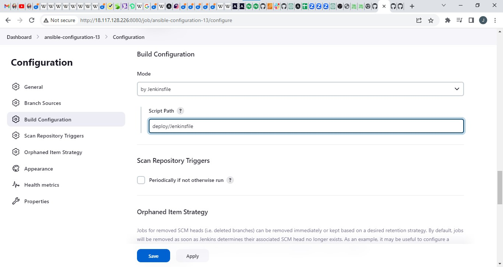

  - This triggers a build from the configuration in the ``Jenkinsfile`` 
  
  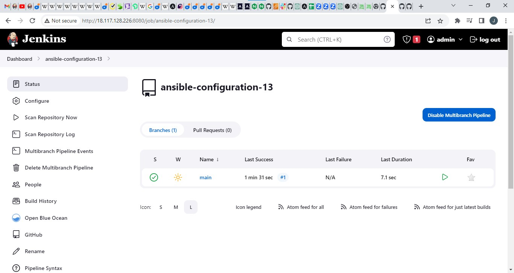

    To really appreciate and feel the difference of Cloud Blue UI, it is recommended to try triggering the build again from Blue Ocean interface. ``click blue ocean`` 
    
    The pipeline in blue ocean UI below
    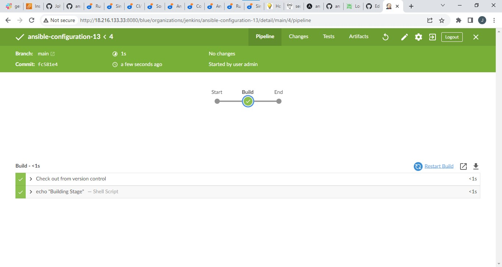

The pipeline is a multibranch one, implying that if there were more than one branch in GitHub, Jenkins would scan the repository to discover them all and we would be able to trigger a build for each branch.

For example,

Let us create a new git branch and name it ``feature/jenkinspipeline-stages``

Currently we only have the **Build stage**. Let us add another stage called **Test**. Paste the code snippet below and push the new changes to GitHub.

```
 pipeline {
    agent any

  stages {
    stage('Build') {
      steps {
        script {
          sh 'echo "Building Stage"'
        }
      }
    }

    stage('Test') {
      steps {
        script {
          sh 'echo "Testing Stage"'
        }
      }
    }
    }
}

```
To ensure that a branch(es) show up in jenkins, always use the ``scan repository`` button each time to refresh for new builds.

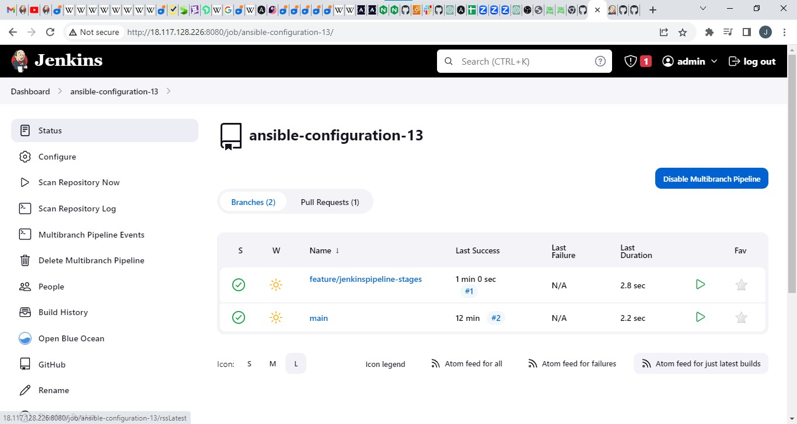
Notice the new build - ``feature/jenkinspipeline-stages`` 

click ``blue ocean`` to observe the pipeline better.
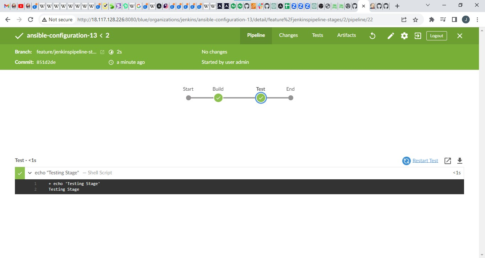
Notice the new stage added to the script.

***
#### A Quick Task
 
 1. Create a pull request to merge the latest code into the `main branch`
2. After merging the `PR`, go back into your terminal and switch into the `main` branch.
3. Pull the latest change.
4. Create a new branch, add more stages into the Jenkins file to simulate below phases. (Just add an `echo` command like we have in `build` and `test` stages)
   1. Package 
   2. Deploy 
   3. Clean up
5. Verify in Blue Ocean that all the stages are working, then merge your feature branch to the main branch
6. Eventually, your main branch should have a successful pipeline like this in blue ocean

.jpg>)

### STEP 3 RUNNING ANSIBLE PLAYBOOK FROM JENKINS
ANSIBLE SET-UP

- Install ansible on Jenkins. See ``READme`` file for dependencies.
- Install ansible plugin on Jenkins UI. *For guide for the set-up, watch video [here](https://youtu.be/PRpEbFZi7nI)*


- Create a new **Jenkinsfile** - Delete the content of the one used in previous unit tests.
- Along side the `Jenkinsfile` in the deploy directory, create an `ansible.cfg` file

#### Ansible.cfg file
paste the code below into the `ansible.cfg` file
```
[defaults]
timeout = 160
callback_whitelist = profile_tasks
log_path=~/ansible.log
host_key_checking = False
gathering = smart
ansible_python_interpreter=/usr/bin/python3
allow_world_readable_tmpfiles=true


[ssh_connection]
ssh_args = -o ControlMaster=auto -o ControlPersist=30m -o ControlPath=/tmp/ansible-ssh-%h-%p-%r -o ServerAliveInterval=60 -o ServerAliveCountMax=60 -o ForwardAgent=yes
```
The code above is  a custom ansible.cfg file to define a custom ansible behaviour. 
The roles path is not defined in there yet, It will be defined dynamically in the ``jenkinsfile`` to enable jenkins job to be run from either git ``main`` or any ``branch``, seemlessly.
 
`ansible.cfg` must be exported to an environment variable to so that `Ansible` knows where to find the `Roles`

### Jenkinsfile
Find pipeline code in the ``jenkinsfile`` below
```
pipeline {
  agent any

  environment {
      ANSIBLE_CONFIG="${WORKSPACE}/deploy/ansible.cfg"
    }

  parameters {
      string(name: 'inventory', defaultValue: 'dev',  description: 'This is the inventory file for the environment to deploy configuration')
    }

  stages{
      stage("Initial cleanup") {
          steps {
            dir("${WORKSPACE}") {
              deleteDir()
            }
          }
        }

      stage('Checkout SCM') {
         steps{
            git branch: 'main', url: 'https://github.com/Johnstx/ansible-configuration-13.git'
         }
       }

      stage('Prepare Ansible For Execution') {
        steps {
          sh 'echo ${WORKSPACE}' 
          sh 'sed -i "3 a roles_path=${WORKSPACE}/roles" ${WORKSPACE}/deploy/ansible.cfg'  
        }
     }

      stage('Run Ansible playbook') {
        steps {
           ansiblePlaybook become: true, colorized: true, credentialsId: 'private-key', disableHostKeyChecking: true, installation: 'ansible', inventory: 'inventory/${inventory}', playbook: 'playbooks/site.yml'
         }
      }

      stage('Clean Workspace after build'){
        steps{
          cleanWs(cleanWhenAborted: true, cleanWhenFailure: true, cleanWhenNotBuilt: true, cleanWhenUnstable: true, deleteDirs: true)
        }
      }
   }

}
```


NB: Here ansible will be be designed run against the Dev environment.

`dev` environment will have the architecture below
```
[nginx]
<Nginx-Private-IP-Address ansible_ssh_user='ec2-user'>


[db]
<DB-Server-Private-IP-Address ansible_ssh_user='ubuntu'>

```
Note the instances type for `nginx` - RHEL and `db` - Ubuntu

