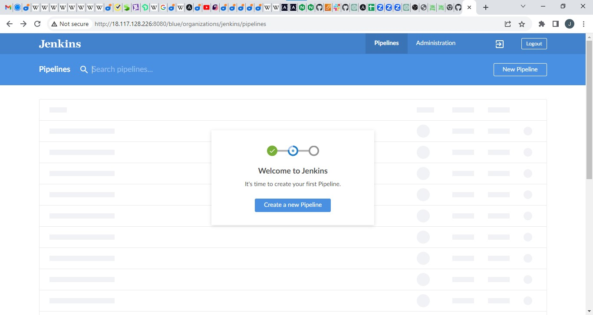
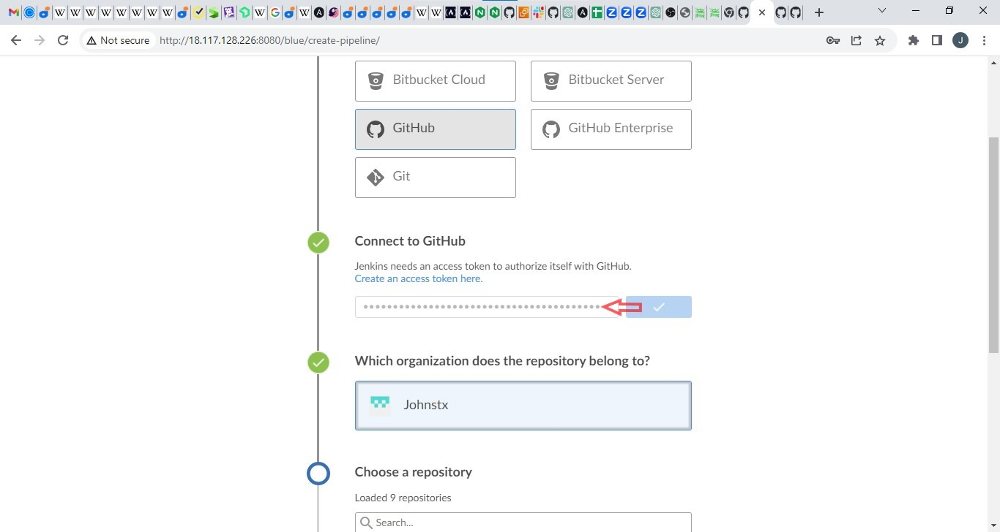

### PROJECT 14

#### EXPERIENCE CONTINUOUS INTEGRATION WITH JENKINS | ANSIBLE | ARTIFACTORY | SONARQUBE | PHP

This Projects applies the entire concept around **CI/CD** from application perspective. To fully gain real expertsse around this idea, it is best to see it in action accross different programming languages and also from the platorm perspective - this entails working with platforms like [Terraform](https://www.terraform.io), [Docker](https://www.docker.com) and [Kubernetes](https://www.kubernetes.io).
For this application perspective, we will be focusing on **[PHP](https://en.wikipedia.org/wiki/PHP)**

As a prerequisite for this project, it is important to understand the entire CI/CD process, roles of each tool and success metrics so its important to familiarise self with the concept and the required tools.

To emphasize a typical CI Pipeline further, let us explore the diagram below a little deeper.


- **Version Control:** This is the stage where developers’ code gets committed and pushed after they have tested their work locally.

- **Build:** Depending on the type of language or technology used, we may need to build the codes into binary executable files (in case of compiled languages) or just package the codes together with all necessary dependencies into a deployable package (in case of interpreted languages).

- **Unit Test:** Unit tests that have been developed by the developers are tested. Depending on how the CI job is configured, the entire pipeline may fail if part of the tests fails, and developers will have to fix this failure before starting the pipeline again. 
**A Job**  is a phase in the pipeline. 
**Unit Test** is a phase, therefore it can be considered a job on its own.

- **Deploy:** Once the tests are passed, the next phase is to deploy the compiled or packaged code into an artifact repository. This is where all the various versions of code including the latest will be stored. The CI tool will have to pick up the code from this location to proceed with the remaining parts of the pipeline.

- **Auto Test:** Apart from Unit testing, there are many other kinds of tests that are required to analyse the quality of code and determine how vulnerable the software will be to external or internal attacks. These tests must be automated, and there can be multiple environments created to fulfil different test requirements. For example, a server dedicated for Integration Testing will have the code deployed there to conduct integration tests. Once that passes, there can be other sub-layers in the testing phase in which the code will be deployed to, so as to conduct further tests. Such are User Acceptance Testing (UAT), and another can be Penetration Testing. These servers will be named according to what they have been designed to do in those environments. A UAT server is generally be used for UAT, SIT server is for Systems Integration Testing, PEN Server is for Penetration Testing and they can be named whatever the naming style or convention in which the team is used. An environment does not necessarily have to reside on one single server. In most cases it might be a stack as you have defined in your Ansible Inventory. All the servers in the inventory/dev are considered as Dev Environment. The same goes for inventory/stage (Staging Environment) inventory/preprod (Pre-production environment), inventory/prod (Production environment), etc. So, it is all down to naming convention as agreed and used company or team wide.


- **Deploy to production:** Once all the tests have been conducted and either the release manager or whoever has the authority to authorize the release to the production server is happy, he gives green light to hit the deploy button to ship the release to production environment. This is an Ideal Continuous Delivery Pipeline. If the entire pipeline was automated and no human is required to manually give the Go decision, then this would be considered as Continuous Deployment. Because the cycle will be repeated, and every time there is a code commit and push, it causes the pipeline to trigger, and the loop continues over and over again.

- **Measure and Validate:** This is where live users are interacting with the application and feedback is being collected for further improvements and bug fixes

#### Principles of a reliable and robust **CI/CD**

- Maintain a code repository

- Automate build process

- Make builds self-tested

- Everyone commits to the baseline every day

- Every commit to baseline should be built

- Every bug-fix commit should come with a test case

- Keep the build fast

- Test in a clone of production environment

- Make it easy to get the latest deliverables

- Everyone can see the results of the latest build

- Automate deployment (if you are confident enough in your CI/CD pipeline and willing to go for a fully automated Continuous Deployment)


In this Project, I will simulate the CI/CD pipeline of a **PHP** based application. The process will look like diagram shown below


This Project will continue from **Project 13**, and will use the following 

Repos
- **Ansible configuration mgt** - Tooling app for deployement through Ansible. Jenkinsfile contains the roles that configures the architecture reqiured to run the application.
- **php-todo** - An application with *unit tests* that shows a CI/CD pipeline. Jenkinsfile  runs the CI/CD piepline for a PHP app.

Tools
- **Ansible**
- **Jenkins** 
- **J-frog artifactory** -  A binary repository manager that will be used to manage our build artifacts
- **Sonarqube** - For continous inspection of code quality.

Instances
- **RHEL 8** server (*t2 medium*) - for the jenkins & ansible
- **Ubuntu 20.04** - for the artifactory

Now lets begin

### STEP 0 - JENKINS SET-UP
- create a RHEL server named
```
jenkins-ansible
```

Add ssh keys to ssh agent to enable remote connection from vscode. 

``shh-add -k "keyname.pem"`` 

ssh into ``jenkins-ansible`` server, install git if not installed.

- import repo from github
``` 
git clone https://github.com/Johnstx/ansible-configuration-13.git 
```
- switch to *root user* and Install Jenkins


``` 
sudo su

yum install wget -y

wget -O /etc/yum.repos.d/jenkins.repo \
    https://pkg.jenkins.io/redhat-stable/jenkins.repo
rpm --import https://pkg.jenkins.io/redhat-stable/jenkins.io-2023.key

yum install -y https://dl.fedoraproject.org/pub/epel/epel-release-latest-8.noarch.rpm

yum install -y dnf-utils http://rpms.remirepo.net/enterprise/remi-release-8.rpm

 yum install java-11-openjdk-devel -y

```

*open the bash profile*
```
vi .bash_profile
```

paste the below in the bash profile

```
export JAVA_HOME=$(dirname 
(readlink 
(which javac))))) export PATH=$PATH:$JAVA_HOME/bin export CLASSPATH=.:$JAVA_HOME/jre/lib:$JAVA_HOME/lib:$JAVA_HOME/lib/tools.jar
```

reload the bash profile
```
source ~/.bash_profile
```
``exit`` the root *user*  and install Jenkins

```
sudo yum install jenkins
```

Guide to install jenkins [**here**](https://www.jenkins.io/doc/book/installing/)

Enable, start and check status of jenkins

```
sudo systemctl enable jenkins

sudo systemctl start jenkins

sudo systemctl status jenkins


sudo systemctl daemon-reload
```


 ### STEP 1
 CONFIGURING ANSIBLE FOR JENKINS DEPLOYMENT


In the previous projects, we launched ansible from the CLI but after this configuration, we will be able to run ansible from jenkins UI.

1. Open the Jenkins URL, install and open Blue ocean plugin
.jpg>)

2. create a new pipeline


3. Select Github


4. Connect Jenkins with Github


5. Login to GitHub & Generate an Access Token


6. Copy access token


7. Paste the token in the jenkins UI and connect



8. Create a pipeline from github repo


9. Exit from blue ocean by clicking on he administator tab


10. Created pipeline takes the name of the github repo that was selected earlier.


### STEP 2
CREATE A JENKINSFILE
All the tests I want to run will be stated as code in a ``jenkinsfile``.

- So, In the ansible repo, I will create a directory called ``deploy`` and create a  ``` jenkinsfile ``` inside the directory.


- The code snippet below is added into the jenkinsfile
```
pipeline {
    agent any


  stages {
    stage('Build') {
      steps {
        script {
          sh 'echo "Building Stage"'
        }
      }
    }
    }
}
```
This is a simple pipeline with a stage called ``build``, and using a ```shell script``` module to echo ```Building Stage```. Save, commit and push to the github repo


- CONFIGURE JENKINS TO RUN PIPELINE FROM THE JENKINS FILE

1. In the jenkins UI, click the the ansible project (repo)
2. Click on  the ``configure`` tab

3. Set the **script path** of **build configuration** to the ```deploy/Jenkinsfile```. Apply and save these changes made.


  - This triggers a build from the configuration in the ``Jenkinsfile`` 
  
  

    To really appreciate and feel the difference of Cloud Blue UI, it is recommended to try triggering the build again from Blue Ocean interface. ``click blue ocean`` 
    
    The pipeline in blue ocean UI below
    

The pipeline is a multibranch one, implying that if there were more than one branch in GitHub, Jenkins would scan the repository to discover them all and we would be able to trigger a build for each branch.

For example,

Let us create a new git branch and name it ``feature/jenkinspipeline-stages``

Currently we only have the **Build stage**. Let us add another stage called **Test**. Paste the code snippet below and push the new changes to GitHub.

```
 pipeline {
    agent any

  stages {
    stage('Build') {
      steps {
        script {
          sh 'echo "Building Stage"'
        }
      }
    }

    stage('Test') {
      steps {
        script {
          sh 'echo "Testing Stage"'
        }
      }
    }
    }
}

```
To ensure that a branch(es) show up in jenkins, always use the ``scan repository`` button each time to refresh for new builds.


Notice the new build - ``feature/jenkinspipeline-stages`` 

click ``blue ocean`` to observe the pipeline better.

Notice the new stage added to the script.

***
#### A Quick Task
 
 1. Create a pull request to merge the latest code into the `main branch`
2. After merging the `PR`, go back into your terminal and switch into the `main` branch.
3. Pull the latest change.
4. Create a new branch, add more stages into the Jenkins file to simulate below phases. (Just add an `echo` command like we have in `build` and `test` stages)
   1. Package 
   2. Deploy 
   3. Clean up
5. Verify in Blue Ocean that all the stages are working, then merge your feature branch to the main branch
6. Eventually, your main branch should have a successful pipeline like this in blue ocean

.jpg>)

### STEP 3 RUNNING ANSIBLE PLAYBOOK FROM JENKINS
ANSIBLE SET-UP

- Install ansible on Jenkins. See ``READme`` file for dependencies.
- Install ansible plugin on Jenkins UI. *For guide for the set-up, watch video [here](https://youtu.be/PRpEbFZi7nI)*


- Create a new **Jenkinsfile** As per [jenkinsfile](ansible-configuration-13/deploy/Jenkinsfile)
- Along side the `Jenkinsfile` in the deploy directory, create an `ansible.cfg` file as per [ansible](ansible-configuration-13/deploy/ansible.cfg)

- `Ansible.cfg` contains a configuration to define a custom ansible behaviour. The roles path is not defined in it rather it is done dynamically in the ``jenkinsfile`` using the **[Stream Editor](https://www.gnu.org/software/sed/manual/sed.html)** ```sed```.

- `ansible.cfg` must be exported to an environment variable to so that `Ansible` knows where to find the `Roles`
- This ``ansible`` playbook is run against the ``dev`` environment.
 


``NB:``
As seen in the `jenkinsfile`, Ansible runs against the `dev` environment and updates the resources present there as desired. But we also need to deploy similar or more programs to other environments, e.g ``ci``, ``sit``, etc. Manual configuration of the Jenkinsfile to point inventory to those environments is not an option neither is dedicating a git branch for each environment and hard coding the inventory value.
Instead we ``Parameterize``

### PARAMETERIZING ``Jenkinsfile`` FOR ANSIBLE DEPLOYMENT

To deploy to other environment, we will need to use parameters.
#### STEPS

1. Update the ``ci` inventory with new severs -

```
[jenkins]
<Jenkins-Private-IP-Address>

[nginx]
<Nginx-Private-IP-Address>

[sonarqube]
<SonarQube-Private-IP-Address>

[artifact_repository]
<Artifact_repository-Private-IP-Address>

```

2. Update the ``jenkinsfile`` to introduce parameterization.  Below is just one parameter. It has a default value in case if no value is specified at execution. It also has a description so that everyone is aware of its purpose.

```
pipeline {
    agent any

    parameters {
      string(name: 'inventory', defaultValue: 'dev',  description: 'This is the inventory file for the environment to deploy configuration')
    }
}
...


```

3. In the Ansible execution section, remove the hardcoded inventory/dev and replace with `${inventory}. Find in [jenkinsfile](ansible-configuration-13/deploy/Jenkinsfile) Ln 36, Col 172.

Then each time the playbook is run, it will need an input of the desired environment to run the program on 


4. Notice that the default value loads up, but we can now specify which environment we want to deploy the configuration to. Simply type ``ci`` and hit Run


5. Add another parameter. This time, introduce tagging in Ansible. You can limit the Ansible execution to a specific role or playbook desired.  Therefore, add an Ansible tag to run against webserver only. Test this locally first to get the experience. Once you understand this, update Jenkinsfile and run it from Jenkins.

### CI/CD Pipeline for TODO application

We already have ``tooling`` website as a part of deployment through Ansible. Here we will introduce another PHP application to add to the list of software products we are managing in our infrastructure. The good thing with this particular application is that it has unit tests, and it is an ideal application to show an end-to-end CI/CD pipeline for a particular application.

Our goal here is to deploy the application onto servers directly from ``Artifactory`` rather than from ``git``. If you have not updated Ansible with an Artifactory role, simply use this guide to create an Ansible role for Artifactory (ignore the Nginx part). [Configure Artifactory on Ubuntu 20.04](https://www.howtoforge.com/tutorial/ubuntu-jfrog/). We will use this soon to spin up the  artifactory server.

### PHASE 1 - Prepare Jenkins
Fork the repository below into your GitHub account
```
https://github.com/Johnstx/php-todo.git
```
On the Jenkins server, install PHP, its dependencies and [Composer tool](https://getcomposer.org/) (Feel free to do this manually at first, then update your Ansible accordingly later)

PHP install

    yum module reset php -y
    yum module enable php:remi-7.4 -y
    yum install -y php php-common php-mbstring php-opcache php-intl php-xml php-gd php-curl php-mysqlnd php-fpm php-json
    systemctl start php-fpm
    systemctl enable php-fpm


Composer install

    curl -sS https://getcomposer.org/installer | php
    sudo mv composer.phar /usr/bin/composer

Verify Composer is installed or not

    composer --version


3. Install Jenkins plugins
    1. [Plot plugin](https://plugins.jenkins.io/plot/)
    2. [Artifactory plugin](https://www.jfrog.com/confluence/display/JFROG/Jenkins+Artifactory+Plug-in)

Use of Plugins

``Plot`` plugin - to display tests reports, and code coverage information.

``Artifactory`` plugin - will be used to easily upload code artifacts into an Artifactory server.

4. Let's Create that EC2 instance for the ``artifactory`` server, using ubuntu 20.04. 
Then run the jenkinsfile to install artifactory from the artifactory roles created earlier.


Browsing the ``artifactory`` server URL opens the jfrog UI as seen below. Login with default credentials and set up an artifactory repository named **PBL**


5. Configure Artifactory in the Jenkins UI

Configure the server ID, URL and Credentials, run Test Connection.


### PHASE 2 - Integrate Artifatory repository with Jenkins
1. In the php-todo repo, create a dummy ``jenkinsfile``. ``Add`` and ``push`` to ``git`` repo
2. Using Blue Ocean, create a multibranch Jenkins pipeline.
3. On the database server, create a database and user as per below. *since we are using the ``roles``, this step is achieved by updating the database(mysql) roles to run this job. Privileges is granted to the jenkins server*
  
**mysql-roles file**


    Create database homestead;
    CREATE USER 'homestead'@'%' IDENTIFIED BY 'sePret^i';
    GRANT ALL PRIVILEGES ON * . * TO 'homestead'@'%';

4. Update the database connectivity requirements in the file ``.env.sample``
  code below was added to the ``.env.sample`` file in the ``php-todo`` repo 

        DB_CONNECTION=mysql
        DB_PORT=3306
      
 and the DB_HOST=<private IP of DB host>

 viz;

    DB_HOST=172.31.8.8
    DB_DATABASE=homestead
    DB_USERNAME=homestead
    DB_PASSWORD=sePret^i
    DB_CONNECTION=mysql
    DB_PORT=3306

5. Update Jenkinsfile with proper pipeline configuration

        pipeline {
            agent any

          stages {

            stage("Initial cleanup") {
                  steps {
                    dir("${WORKSPACE}") {
                      deleteDir()
                    }
                  }
                }
          
            stage('Checkout SCM') {
              steps {
                    git branch: 'main', url: 'https://github.com/Johnstx/php-todo.git'
              }
            }

            stage('Prepare Dependencies') {
              steps {
                    sh 'mv .env.sample .env'
                    sh 'composer install'
                    sh 'php artisan migrate'
                    sh 'php artisan db:seed'
                    sh 'php artisan key:generate'
              }
            }
          }
        }


**Notice the Prepare Dependencies section**

The required file by PHP is `` .env`` so we are renaming ``.env.sample`` to ``.env``

``Composer`` is used by`` PHP`` to install all the dependent libraries used by the application

``php artisan`` uses the ``.env`` file to setup the required database objects - (After successful run of this step, login to the database, run ``show tables`` and see the tables being created)


1. Update the Jenkinsfile to include Unit tests step

        stage('Execute Unit Tests') 
          steps {
                sh './vendor/bin/phpunit'
          } 


### Phase 3 - Code Quality Analysis
IT is impoertant to have a stage that looks at the quality of the code/app in the build. This stage handles that task
This is one of the areas where developers, architects and many stakeholders are mostly interested in as far as product development is concerned. DevOps engineer, also have a role to play. Especially when it comes to setting up the tools.
For PHP the most commonly tool used for code quality analysis is [phploc](https://phpqa.io/projects/phploc.html) (*since we are buidling a php application*). [Read the article here for more](https://matthiasnoback.nl/2019/09/using-phploc-for-quick-code-quality-estimation-part-1/)

The data produced by phploc can be ploted onto graphs in Jenkins.

1. Add the code analysis step in ``Jenkinsfile``. The output of the data will be saved in ``` build/logs/phploc.csv ``` file.

        stage('Code Analysis') {
          steps {
                sh 'phploc app/ --log-csv build/logs/phploc.csv'

          }
        }


2. Plot the data using plot Jenkins plugin.

This plugin provides generic plotting (or graphing) capabilities in Jenkins. It will plot one or more single values variations across builds in one or more plots. Plots for a particular job (or project) are configured in the job configuration screen, where each field has additional help information. Each plot can have one or more lines (called data series). After each build completes the plots' data series latest values are pulled from the CSV file generated by phploc.
Paste thecode below to the ``jenkinsfile``

    stage('Plot Code Coverage Report') {
      steps {

            plot csvFileName: 'plot-396c4a6b-b573-41e5-85d8-73613b2ffffb.csv', csvSeries: [[displayTableFlag: false, exclusionValues: 'Lines of Code (LOC),Comment Lines of Code (CLOC),Non-Comment Lines of Code (NCLOC),Logical Lines of Code (LLOC)                          ', file: 'build/logs/phploc.csv', inclusionFlag: 'INCLUDE_BY_STRING', url: '']], group: 'phploc', numBuilds: '100', style: 'line', title: 'A - Lines of code', yaxis: 'Lines of Code'
            plot csvFileName: 'plot-396c4a6b-b573-41e5-85d8-73613b2ffffb.csv', csvSeries: [[displayTableFlag: false, exclusionValues: 'Directories,Files,Namespaces', file: 'build/logs/phploc.csv', inclusionFlag: 'INCLUDE_BY_STRING', url: '']], group: 'phploc', numBuilds: '100', style: 'line', title: 'B - Structures Containers', yaxis: 'Count'
            plot csvFileName: 'plot-396c4a6b-b573-41e5-85d8-73613b2ffffb.csv', csvSeries: [[displayTableFlag: false, exclusionValues: 'Average Class Length (LLOC),Average Method Length (LLOC),Average Function Length (LLOC)', file: 'build/logs/phploc.csv', inclusionFlag: 'INCLUDE_BY_STRING', url: '']], group: 'phploc', numBuilds: '100', style: 'line', title: 'C - Average Length', yaxis: 'Average Lines of Code'
            plot csvFileName: 'plot-396c4a6b-b573-41e5-85d8-73613b2ffffb.csv', csvSeries: [[displayTableFlag: false, exclusionValues: 'Cyclomatic Complexity / Lines of Code,Cyclomatic Complexity / Number of Methods ', file: 'build/logs/phploc.csv', inclusionFlag: 'INCLUDE_BY_STRING', url: '']], group: 'phploc', numBuilds: '100', style: 'line', title: 'D - Relative Cyclomatic Complexity', yaxis: 'Cyclomatic Complexity by Structure'      
            plot csvFileName: 'plot-396c4a6b-b573-41e5-85d8-73613b2ffffb.csv', csvSeries: [[displayTableFlag: false, exclusionValues: 'Classes,Abstract Classes,Concrete Classes', file: 'build/logs/phploc.csv', inclusionFlag: 'INCLUDE_BY_STRING', url: '']], group: 'phploc', numBuilds: '100', style: 'line', title: 'E - Types of Classes', yaxis: 'Count'
            plot csvFileName: 'plot-396c4a6b-b573-41e5-85d8-73613b2ffffb.csv', csvSeries: [[displayTableFlag: false, exclusionValues: 'Methods,Non-Static Methods,Static Methods,Public Methods,Non-Public Methods', file: 'build/logs/phploc.csv', inclusionFlag: 'INCLUDE_BY_STRING', url: '']], group: 'phploc', numBuilds: '100', style: 'line', title: 'F - Types of Methods', yaxis: 'Count'
            plot csvFileName: 'plot-396c4a6b-b573-41e5-85d8-73613b2ffffb.csv', csvSeries: [[displayTableFlag: false, exclusionValues: 'Constants,Global Constants,Class Constants', file: 'build/logs/phploc.csv', inclusionFlag: 'INCLUDE_BY_STRING', url: '']], group: 'phploc', numBuilds: '100', style: 'line', title: 'G - Types of Constants', yaxis: 'Count'
            plot csvFileName: 'plot-396c4a6b-b573-41e5-85d8-73613b2ffffb.csv', csvSeries: [[displayTableFlag: false, exclusionValues: 'Test Classes,Test Methods', file: 'build/logs/phploc.csv', inclusionFlag: 'INCLUDE_BY_STRING', url: '']], group: 'phploc', numBuilds: '100', style: 'line', title: 'I - Testing', yaxis: 'Count'
            plot csvFileName: 'plot-396c4a6b-b573-41e5-85d8-73613b2ffffb.csv', csvSeries: [[displayTableFlag: false, exclusionValues: 'Logical Lines of Code (LLOC),Classes Length (LLOC),Functions Length (LLOC),LLOC outside functions or classes ', file: 'build/logs/phploc.csv', inclusionFlag: 'INCLUDE_BY_STRING', url: '']], group: 'phploc', numBuilds: '100', style: 'line', title: 'AB - Code Structure by Logical Lines of Code', yaxis: 'Logical Lines of Code'
            plot csvFileName: 'plot-396c4a6b-b573-41e5-85d8-73613b2ffffb.csv', csvSeries: [[displayTableFlag: false, exclusionValues: 'Functions,Named Functions,Anonymous Functions', file: 'build/logs/phploc.csv', inclusionFlag: 'INCLUDE_BY_STRING', url: '']], group: 'phploc', numBuilds: '100', style: 'line', title: 'H - Types of Functions', yaxis: 'Count'
            plot csvFileName: 'plot-396c4a6b-b573-41e5-85d8-73613b2ffffb.csv', csvSeries: [[displayTableFlag: false, exclusionValues: 'Interfaces,Traits,Classes,Methods,Functions,Constants', file: 'build/logs/phploc.csv', inclusionFlag: 'INCLUDE_BY_STRING', url: '']], group: 'phploc', numBuilds: '100', style: 'line', title: 'BB - Structure Objects', yaxis: 'Count'


      }
    }


The plot UI illustration.


3. Bundle the application code for into an artifact (archived package) upload to Artifactory

        stage ('Package Artifact') {
            steps {
                    sh 'zip -qr php-todo.zip ${WORKSPACE}/*'
            }
            }

4. Publish the resulted artifact into Artifactory

        stage ('Upload Artifact to Artifactory') {
                  steps {
                    script { 
                        def server = Artifactory.server 'artifactory-server'                 
                        def uploadSpec = """{
                            "files": [
                              {
                              "pattern": "php-todo.zip",
                              "target": "PBL/php-todo",
                              "props": "type=zip;status=ready"

                              }
                            ]
                        }""" 

                        server.upload spec: uploadSpec
                      }
                    }

                }

5. Deploy the application to the dev environment by launching Ansible pipeline.
Create a ``ToDo`` server in the dev envrionment, and run on the ToDo server as host. See the ``site.yml`` file for reference

        stage ('Deploy to Dev Environment') {
            steps {
            build job: 'ansible-project/main', parameters: [[$class: 'StringParameterValue', name: 'env', value: 'dev']], propagate: false, wait: true
            }
          }


After a succesful deployment, see result -


The build job used in this step tells Jenkins to start another job. In this case it is the ``ansible-project`` job, and we are targeting the ``main`` branch. Hence, we have ``ansible-project/main``. Since the Ansible project requires parameters to be passed in, we have included this by specifying the `` parameters`` section. The name of the parameter is ``env`` and its value is ``dev``. Meaning, deploy to the Development environment.
But how are we certain that the code being deployed has the quality that meets corporate and customer requirements? Even though we have implemented ``Unit Tests`` and ``Code Coverage`` Analysis with ``phpunit`` and ``phploc``, we still need to implement **Quality Gate** to ensure that ONLY code with the required code coverage, and other quality standards make it through to the environments.
To achieve this, we need to configure **SonarQube** - An open-source platform developed by **SonarSource** for continuous inspection of code quality to perform automatic reviews with static analysis of code to detect bugs, code smells, and security vulnerabilities.

### SonarQube Installation

We have a role the ansible repo that will install SonarQube

1. Create an instance for SonarQube, using **Ubuntu 20.04 With PostgreSQL as Backend Database**
2. Update the `ci` environment in the ``/inventory`` with the above SonarQube (instance) ``private IP`` and ``user``, ``site.yml`` in `/playbooks` is also set up by ensuring the ``host`` is correctly named and **ONLY** `SonarQube` playbook is higlighted to run.


3. Add, commit and push to ``git``.

    **NB**
    1. The key of the *SonarQube* instance is added to **ssh agent**
    2. An error was returned while running this playbook, to fix it, install this Ansible dependency for Postgresql Database

            - ansible-galaxy collection install community.postgresql


4. Update the ```ansible.cfg``` by adding the role-path.


    SonarQube Installation in Jenkins


    SonarQube installed. Opened in browser using ``http://SonarQube-IP:9000/sonar`` 


### CONFIGURE SONARQUBE AND JENKINS FOR QUALITY GATE

1. In Jenkins, [SonarScanner plugin](https://docs.sonarqube.org/latest/analysis/scan/sonarscanner-for-jenkins/) is installed.

2. SonarQube server plugin is then added in Jenkins 
 
        Manage Jenkins > Configure System
    

3. Generate authentication token in SonarQube 
  ```
  User > My Account > Security > Generate Tokens
  ```


4. Configure Quality Gate Jenkins Webhook in SonarQube – The URL points to the Jenkins server *http://{JENKINS_HOST}/sonarqube-webhook/*
```
  Administration > Configuration > Webhooks > Create
```


5. Setup SonarQube scanner from Jenkins - Global Tool Configuration
  ```
  Manage Jenkins > Global Tool Configuration 
  ```


6. Update Jenkins Pipeline to include **SonarQube** scanning and Quality Gate
Below is the snippet for a **Quality Gate** stage in ``Jenkinsfile``.


        stage('SonarQube Quality Gate') {
            environment {
                scannerHome = tool 'SonarQubeScanner'
            }
            steps {
                withSonarQubeEnv('sonarqube') {
                    sh "${scannerHome}/bin/sonar-scanner"
                }

            }
        }

**NB** The above step will fail because we have not updated `sonar-scanner.properties
The above script will install scanner tool alrightbbut we need to confire the the properties, so we go into the ``/tools`` directory on the server and configure the ``properties`` file which SonarQube will require to function during the pipeline execution.

    cd /var/lib/jenkins/tools/hudson.plugins.sonar.SonarRunnerInstallation/SonarQubeScanner/conf/

7. Open ``sonar-scanner.properties`` file

        sudo vi sonar-scanner.properties

Add configuration related to ``php-todo`` project


    sonar.host.url=http://<SonarQube-Server-IP-address>:9000
    sonar.projectKey=php-todo
    #----- Default source code encoding
    sonar.sourceEncoding=UTF-8
    sonar.php.exclusions=**/vendor/**
    sonar.php.coverage.reportPaths=build/logs/clover.xml
    sonar.php.tests.reportPath=build/logs/junit.xml


**HINT:** To know what exactly to put inside the sonar-scanner.properties file, SonarQube has a configurations page where you can get some directions.

Lets examint the configuration of the scanner tool on the jenkins server - 

    cd /var/lib/jenkins/tools/hudson.plugins.sonar.SonarRunnerInstallation/SonarQubeScanner/bin

List the content to see the scanner tool ``sonar-scanner``.


8. Generate Jenkins code, navigate to the dashboard for the ``php-todo`` pipeline and click on the **Pipeline Syntax** menu item

        Dashboard > php-todo > Pipeline Syntax

  Click on Steps and select `withSonarQubeEnv`

  Within the generated block, you will use the `sh` command to run shell on the server. For more advanced usage in other projects, you can add to bookmarks this SonarQube documentation page in your browser.
  
  


- Navigate to php-todo project in SonarQube

The quality gate we just included has no effect. Why? Well, because if you go to the SonarQube UI, you will realise that we just pushed a poor-quality code onto the development environment. There re bugs, and there is 0.0% code coverage. (*code coverage is a percentage of unit tests added by developers to test functions and objects in the code*)

A cllick on php-todo project for further analysis, one will find that there is 6 hours' worth of technical debt, code smells and security issues in the code.

