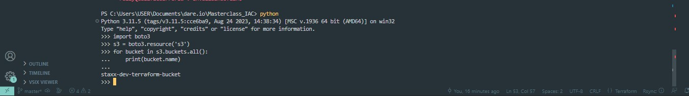
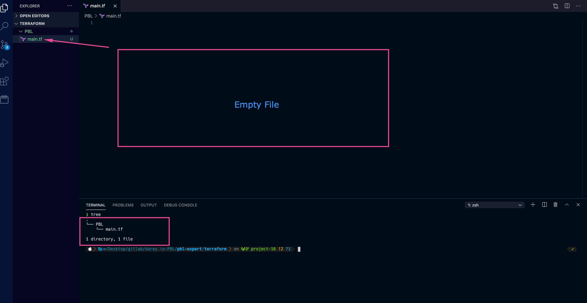
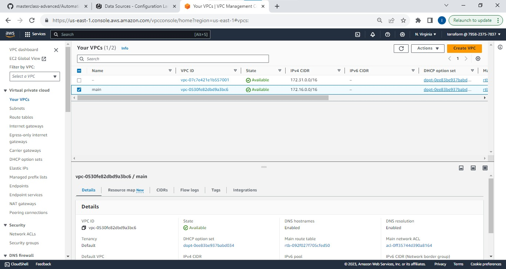

### Automate Infrastructure With IaC using Terraform Part 1
*****
In the Project 15, we manually set-up 2 company websites, however we will automate the set-up of same websites using Terraform.

Terraform is an infrastructure as code tool that lets you build, change, and version infrastructure safely and efficiently. This includes low-level components like compute instances, storage, and networking; and high-level components like DNS entries and SaaS features.

### Steps to take before writing the Terraform code.

1. Create an IAM user, name it `terraform` (*Select programatic access to the AWS account*) and grant the user `AdministratorAccess` permissions.
2. Download the secret access key and access key ID in a safe folder.
3. Configure programmatic access from workstation to connect to AWS using the access keys copied saved from above and a ``Python SDK (boto3)``. ``Python 3.6 ``or higher must be available on this workstation.

*Read [here](https://boto3.amazonaws.com/v1/documentation/api/latest/guide/quickstart.html) to configure Python SDK properly*


[AWS CLI](https://aws.amazon.com/cli/) is used for easier configuration with ``aws configure`` command.

4. Create an S3 bucket to store the Terraform file.
Naming of this file should follow the convention - ```<yourname>-dev-terraform-bucket``` (Note: S3 bucket names must be unique unique within a region partition, you can read about S3 bucken naming [in this article](https://docs.aws.amazon.com/AmazonS3/latest/userguide/bucketnamingrules.html))

After authntication is configured and ``boto3`` installed, test that programmatic access to aws is successful, run the below commannds in ```>python```

    import boto3
    s3 = boto3.resource('s3')
    for bucket in s3.buckets.all():
        print(bucket.name)


The name of the S3 created will appear with the output.



Now lets automate 'project 15' with Terraform.

First, we create a directory structure - 

* Create a folder called ``PBL``
* Create a file in the folder, name is ``main.tf``



Set up Terraform CLI [like this](https://learn.hashicorp.com/tutorials/terraform/install-cli)

We will prevent use of hard coded values, so we will be declaring variables often.

### Provider Block
Provider being used is `aws`. The `region` will be declared as a variable then updated in the provider block, see below.

    variable "region" {
        default = "eu-central-1"
    }

    provider "aws" {
        region = var.region
    }


### VPC Resource Block
Same principle applied in the provider block above is applied in this ``VPC`` resource block, the arguments of the vpc block  are declared as variables first then updated in the ``VPC`` resource block.

    variable "region" {
        default = "eu-central-1"
    }

    variable "vpc_cidr" {
        default = "172.16.0.0/16"
    }

    variable "enable_dns_support" {
        default = "true"
    }

    variable "enable_dns_hostnames" {
        default ="true" 
    }

    variable "enable_classiclink" {
        default = "false"
    }

    variable "enable_classiclink_dns_support" {
        default = "false"
    }

    provider "aws" {
    region = var.region
    }

    # Create VPC
    resource "aws_vpc" "main" {
    cidr_block                     = var.vpc_cidr
    enable_dns_support             = var.enable_dns_support 
    enable_dns_hostnames           = var.enable_dns_support
    enable_classiclink             = var.enable_classiclink
    enable_classiclink_dns_support = var.enable_classiclink

    }

### Subnets

The subnet block has arguments like vpc_id (to indicate the vpc where the subnet resides), count (how many subnets to be created), cidr_block, availability zone etc. Some arguments however may vary with the aws region or with the requirements of the infrastructure e.g availability zone. 

**Loops & Data sources** - **Terraform** will use these concepts to update our block with info outside of **Terraform**, in this case, info about availability zones in **AWS**.

        # Get list of availability zones
        data "aws_availability_zones" "available" {
        state = "available"
        }


To make use of this new`` data`` resource, we will need to introduce a ``count`` argument in the subnet block: Something like this.

    # Create public subnet1
    resource "aws_subnet" "public" { 
        count                   = 2
        vpc_id                  = aws_vpc.main.id
        cidr_block              = "172.16.1.0/24"
        map_public_ip_on_launch = true
        availability_zone       = data.aws_availability_zones.available.names[count.index]

    }

* The **count** tells us that we need 2 subnets. Therefore, Terraform will invoke a loop to create 2 subnets.
* The **data** resource will return a list object that contains a list of AZs. Internally, Terraform will receive the data like this.

        ["eu-central-1a", "eu-central-1b"]

Each of them is an index, the first one is index ``0``, while the other is index ``1``.

The subnet rescource block above has 2 counts, which implies the loop should run twice to build two subnets, however the second subnet will not be created because only 1 cidr was inputed, one cidr cannot be created twice, the next move will be to make the cidr_block dynamic to create one more subnet or even more if the overall design desires.


**Making ``cidr_block`` dynamic** 

We achive this by using [cidrsubnet()](https://developer.hashicorp.com/terraform/language/functions/cidrsubnet function.

New block looks like this. -

    # Create public subnet1
    resource "aws_subnet" "public" { 
        count                   = 2
        vpc_id                  = aws_vpc.main.id
        cidr_block              = cidrsubnet(var.vpc_cidr, 4 , count.index)
        map_public_ip_on_launch = true
        availability_zone       = data.aws_availability_zones.available.names[count.index]

    }

**Making ``count`` dynamic** 

We us the **length()** function. The **length()** function determines the length of a given list, map, or string.

Since ``data.aws_availability_zones.available.names`` returns a list like ``["eu-central-1a", "eu-central-1b", "eu-central-1c"]`` we can pass it into a lenght function and get number of the AZs.

``length(["eu-central-1a", "eu-central-1b", "eu-central-1c"])``

Again, update the subnet block to - 

    # Create public subnet1
        resource "aws_subnet" "public" { 
            count                   = length(data.aws_availability_zones.available.names)
            vpc_id                  = aws_vpc.main.id
            cidr_block              = cidrsubnet(var.vpc_cidr, 4 , count.index)
            map_public_ip_on_launch = true
            availability_zone       = data.aws_availability_zones.available.names[count.index]

        }


* Declare a variable to store the desired number of public subnets, and set the default value.
**NB** We need to create 2 subnets, but there count argument above has ''3''.


    variable "preferred_number_of_public_subnets" {
        default = 2
    }


*  Next, update the ``count`` argument with a condition. Terraform needs to check first if there is a desired number of subnets. Otherwise, use the data returned by the ``lenght`` function. See how that is presented below. 


        # Create public subnets
        resource "aws_subnet" "public" {
        count  = var.preferred_number_of_public_subnets == null ? length(data.aws_availability_zones.available.names) : var.preferred_number_of_public_subnets   
        vpc_id = aws_vpc.main.id
        cidr_block              = cidrsubnet(var.vpc_cidr, 4 , count.index)
        map_public_ip_on_launch = true
        availability_zone       = data.aws_availability_zones.available.names[count.index]

        }


Explanation of the count argument - 
* The first part ``var.preferred_number_of_public_subnets == null`` checks if the value of the variable is set to ``null`` or has some value defined.
* The second part ``?`` and ``length(data.aws_availability_zones.available.names)`` means, if the first part is true, then use this. In other words, if preferred number of public subnets is null (Or not known) then set the value to the data returned by lenght function.
* The third part ``:`` and `` var.preferred_number_of_public_subnets`` means, if the first condition is false, i.e preferred number of public subnets is ``not null`` then set the value to whatever is definied in ``var.preferred_number_of_public_subnets``

So the new configuration now looks like below - 


    # Get list of availability zones
    data "aws_availability_zones" "available" {
    state = "available"
    }

    variable "region" {
        default = "eu-central-1"
    }

    variable "vpc_cidr" {
        default = "172.16.0.0/16"
    }

    variable "enable_dns_support" {
        default = "true"
    }

    variable "enable_dns_hostnames" {
        default ="true" 
    }

    variable "enable_classiclink" {
        default = "false"
    }

    variable "enable_classiclink_dns_support" {
        default = "false"
    }

    variable "preferred_number_of_public_subnets" {
        default = 2
    }

    provider "aws" {
    region = var.region
    }

    # Create VPC
    resource "aws_vpc" "main" {
    cidr_block                     = var.vpc_cidr
    enable_dns_support             = var.enable_dns_support 
    enable_dns_hostnames           = var.enable_dns_support
    enable_classiclink             = var.enable_classiclink
    enable_classiclink_dns_support = var.enable_classiclink

    }


    # Create public subnets
    resource "aws_subnet" "public" {
    count  = var.preferred_number_of_public_subnets == null ? length(data.aws_availability_zones.available.names) : var.preferred_number_of_public_subnets   
    vpc_id = aws_vpc.main.id
    cidr_block              = cidrsubnet(var.vpc_cidr, 4 , count.index)
    map_public_ip_on_launch = true
    availability_zone       = data.aws_availability_zones.available.names[count.index]

    }


### variables.tf & terraform.tfvars

 Introducing variables.tf & terraform.tfvars

 Instead of havng a long lisf of variables in main.tf file, we can actually make our code a lot more readable and better structured by moving out some parts of the configuration content to other files.

 * Put all variable declarations in a separate file
 * Provide non default values to each of them.


 1. Create a new file named ``variable.tf``
 2. Copy all the variable declarations into the new file.
 3. Create another file named `terraform.tfvars`
 4. Set values for each of the variables.

### Maint.tf

    # Get list of availability zones
    data "aws_availability_zones" "available" {
    state = "available"
    }

    provider "aws" {
    region = var.region
    }

    # Create VPC
    resource "aws_vpc" "main" {
    cidr_block                     = var.vpc_cidr
    enable_dns_support             = var.enable_dns_support 
    enable_dns_hostnames           = var.enable_dns_support
    enable_classiclink             = var.enable_classiclink
    enable_classiclink_dns_support = var.enable_classiclink

    }

    # Create public subnets
    resource "aws_subnet" "public" {
    count  = var.preferred_number_of_public_subnets == null ? length(data.aws_availability_zones.available.names) : var.preferred_number_of_public_subnets   
    vpc_id = aws_vpc.main.id
    cidr_block              = cidrsubnet(var.vpc_cidr, 4 , count.index)
    map_public_ip_on_launch = true
    availability_zone       = data.aws_availability_zones.available.names[count.index]
    }


### variables.tf

    variable "region" {
        default = "eu-central-1"
    }

    variable "vpc_cidr" {
        default = "172.16.0.0/16"
    }

    variable "enable_dns_support" {
        default = "true"
    }

    variable "enable_dns_hostnames" {
        default ="true" 
    }

    variable "enable_classiclink" {
        default = "false"
    }

    variable "enable_classiclink_dns_support" {
        default = "false"
    }

    variable "preferred_number_of_public_subnets" {
        default = null
    }


### terraform.tfvars

    region = "eu-central-1"

    vpc_cidr = "172.16.0.0/16" 

    enable_dns_support = "true" 

    enable_dns_hostnames = "true"  

    enable_classiclink = "false" 

    enable_classiclink_dns_support = "false" 

    preferred_number_of_public_subnets = 2


File strucure in the PBL folder should look like this - 

    └── PBL
        ├── main.tf
        ├── terraform.tfstate
        ├── terraform.tfstate.backup
        ├── terraform.tfvars
        └── variables.tf


Finally, run ``terraform plan`` and `terraform apply` and ensure it works fine. Dont forget to delete!

And that is it, **Creation and deletion of AWS Network Infrastructure programmatically with Terraform!**

