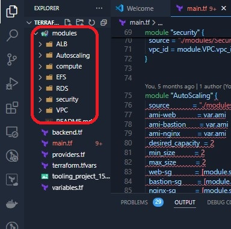
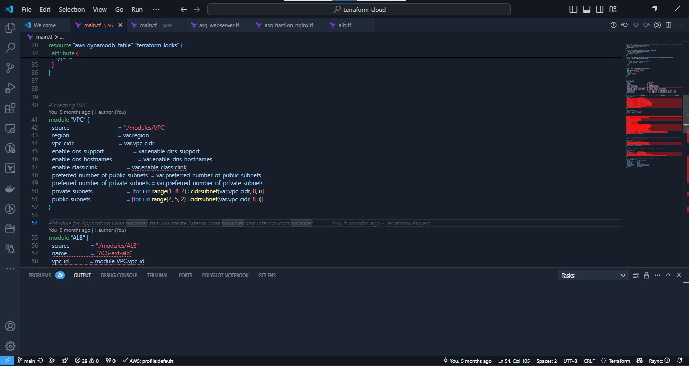

##  Automate Infrastructure With IaC using Terraform. Part 3 - Refactoring

In this project, more advanced concepts is introduced to enhance the AWS IAC developed in the previous projects.

The first concept to be introduced is [backend](https://www.terraform.io/docs/language/settings/backends/index.html)

Each terraform configurtion normally specifies a backend which is responsible for how Terraform stores its state, performs operations, and manages state locking. Terraform stores all the state of the infrastructure here in a ``json`` format.

Backend could either be ``local`` or ``remote`` backend. So far we have used the local backend, which requires no special configuration, and the here the states file is stored 'locally'. This option is not ideal when working in a collaborative scenario where multiple developers/members are in a team, bacause as can be predicted access to your 'local' device will be limited to you only and not to the team. Cloud or ``remote backend`` is  ideal when working in a team of other engineers/ developers. One of the cloud rescources provided by ``AWS``, a cloud service is [``S3 buckets, as a backend``](https://www.terraform.io/docs/language/settings/backends/s3.html).
No doubt S3 backends provides robust storage and east collaborations between teams. Another useful option that is supported by S3 bacekend is [State locking -](https://www.terraform.io/docs/language/state/locking.html).
State locking is used to loc the state for all operations that could write state, this prevents others from acquiring the lock and potentially corrupting your state. State locking feature for S3 backedn is optional and requires another AWS services - [DynamoDB](https://aws.amazon.com/dynamodb/)

To change the Terraform Configuration to use S3 bucket as backend, we have to `` re-initialize`` Terraform.

 * Add S3 bucket and DynamoDB resources blocks before deleting the local state file.
 * Update the terraform block to introduce the backend and locking
 * Re-initialize terraform
 * Delete the local ``tfstate`` file and check the one in S3 bucket.
 * Add ``outputs`` 
 * ``terraform apply``

 To know more on locking with DynamoDB, [check here](https://angelo-malatacca83.medium.com/aws-terraform-s3-and-dynamodb-backend-3b28431a76c1).

 So starting with switching to S3 bucket as backend,

 1. Add S3 bucket resource to the terraform block. NB-  Use  a unique name since S3 buckets have to be unique globally in AWS.

 ```
# Note: The bucket name may not work for you since buckets are unique globally in AWS, so you must give it a unique name.
resource "aws_s3_bucket" "terraform_state" {
  bucket = "dev-terraform-bucket"
  # Enable versioning so we can see the full revision history of our state files
  versioning {
    enabled = true
  }
  # Enable server-side encryption by default
  server_side_encryption_configuration {
    rule {
      apply_server_side_encryption_by_default {
        sse_algorithm = "AES256"
      }
    }
  }
}
``` 
 Terraform stores secret data (Passwords & secret keys) inside the state files, these are processed by resources when required. Therefore is vital to consider to always enable encryption. You can seee how we achived that with [server_side_encryption_configuration](https://docs.aws.amazon.com/AmazonS3/latest/userguide/serv-side-encryption.html).

 * Create DynamoDB table to handle locks and perfrom consistency checks. Locks are handled with a local file, `` terraform.tfstate.lock.info`` when local backend is in use. But in use of S3 as  a backend to store state file, DynamoDB(a cloud storage database) is used to handle the locks. so that anyone running Terraform against this infrastructure can use a central location to control a sittuation where terrafrom is rnning at the same time from multiplr different people.


Dynamo DB resources for locking and consistency checking:

```
resource "aws_dynamodb_table" "terraform_locks" {
  name         = "terraform-locks"
  billing_mode = "PAY_PER_REQUEST"
  hash_key     = "LockID"
  attribute {
    name = "LockID"
    type = "S"
  }
}
```

Terraform expects the S3 bukcets and DynamoDB resources to be created fiest before the backend configuration is implemented. So after the above resources have been put in the block, run ``terrafrom apply`` to provision resources.


*Showing the S3 bucket and DynamoDB provisioning.*

2. Configure s3 Backend.

```
terraform {
  backend "s3" {
    bucket         = "dev-terraform-bucket"
    key            = "global/s3/terraform.tfstate"
    region         = "eu-central-1"
    dynamodb_table = "terraform-locks"
    encrypt        = true
  }
}

```

Then run ``terraform init`` and procced to type ``yes`` if the ouput is desired.


3. Verify the changes.

* In the AWS UI, oberve the above resources are present.


*S3 bucket with the state file object in it*


*DynamoDB containing the 'locks' table*


More observation into the DynamoDB table to check changes BEFORE ``terraform apply`` and AFTER.

*Before ``terraform plan``*


 
*After ``terraform plan``*


4. Add Terraform Output
Add an ``output`` object so that the S3 bucket [Amazon Resource Names ARN](https://docs.aws.amazon.com/general/latest/gr/aws-arns-and-namespaces.html) and DynamoDB table name can be displayed.
In an ``output.tf`` file, paste below:

```
output "s3_bucket_arn" {
  value       = aws_s3_bucket.terraform_state.arn
  description = "The ARN of the S3 bucket"
}
output "dynamodb_table_name" {
  value       = aws_dynamodb_table.terraform_locks.name
  description = "The name of the DynamoDB table"
}
``` 


5. Run ``terraform apply`` 
Terraform will automatically read the latest state from the S3 bucket to determine the current state of the infrastructure. Even if another engineer has applied changes, the state file will always be up to date.
Go to the S3 console, and observe the versions.


*With help of remote backend and locking configuration that we have just configured, collaboration is no longer a problem.*

### Environments
It is very common to have separate workload environments which contains a collection of resources to achieve tasks at diffrerent stages of a job/project. Such isolation of environments into ``dev``, ``sit``, ``uat``, ``prod``, ``preprod`` is implemented to safely and neatly carry out these tasks.
Separation of environments can be achieved using one of two methods:

a. [Terraform Workspaces](https://www.terraform.io/docs/language/state/workspaces.html)

b. **Directory** based separation using ``terraform.tfvars`` file.

**Terraform workspaces** are used when the environments have some significant similarities.
while  **Directory** are used to separate environments with significant configuration differences.

Another way to fine-tune the IAC is to employ the use of **refactoring** codes.


### Refactoring Security groups with ``dynamic block``

For repetitive blocks of code you can use ``dynamic blocks`` in Terraform. [Learn more](https://youtu.be/tL58Qt-RGHY)

*security groups*


*Refactoring  security group*
.


### Refactoring EC2  with ``Map`` and ``Lookup``.
An example of when ``Map`` and ``Lookup`` functions can be used is in the provisioning of AMI. Lets say an AMI which by the way is a regional service is provisioned in a certain region, ``us-east-1`` for example, and during the course of the projects, the region was changed to another, say ``us-west-2``, and we need to maintain same AMI's used in the former region, we can then use the ``Map`` and ``Lookup`` functions for this.

``Map`` uses a ``kay`` and ``value`` pairs as a data structure that can be set as a default type for variables.

```
variable "images" {
    type = "map"
    default = {
        us-east-1 = "image-1234"
        us-west-2 = "image-23834"
    }
}
```

To select the required AMI oer region, use ``Lookup`` function --
``lookup(map, key, [default])``

Note: A default value is better to be used to avoid failure whenever the map data has no key.

```
resource "aws_instace" "web" {
    ami  = "${lookup(var.images, var.region), "ami-12323"}
}
```

Now, the lookup function will load the variable ```images``` using the first parameter. But it also needs to know which of the key-value pairs to use. That is where the second parameter comes in. The key ```us-east-1``` could be specified, but then we will not be doing anything dynamic there, but if we specify the variable for region, it simply resolves to one of the keys. That is why we have used ``var.region`` in the second parameter.


### Use of conditional Expressions: Will be used in subsequent projects


### Use of Modules
**Moodules** are another way of building a  comprehensive and reusable IAC code strucuture.
Modules serve as containers that allow to logically group Terraform codes for similar resources in the same domain (e.g., Compute, Networking, AMI, etc.). One root module can call other child modules and insert their configurations when applying Terraform config. This concept makes your code structure neater, and it allows different team members to work on different parts of configuration at the same time.

Module is just a collection of .tf and/or .tf.json files in a directory.

Refactoring using Modules makes your project structure appear like -- *see below*



### Calling up Modules in the **root module** -- 

a. Import module as a ``source`` and have access to its variables via ``var`` keyword:

```
module "network" {
  source = "./modules/network"
}

```

.


b. Refer to a module's output by specifying the full path to the output variable by using module.``%module_name%.%output_name%`` construction:

```
subnets-compute = module.network.public_subnets-1
```

In this page, we have developed and refactored AWS Infracstructure as Code with Terraform!.