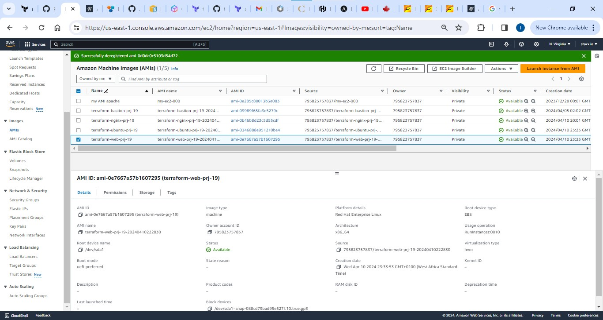
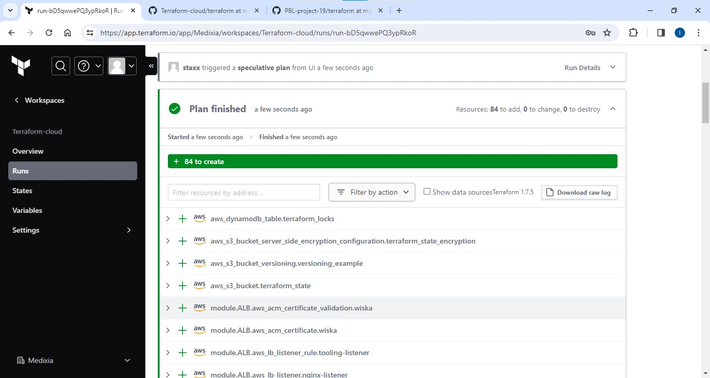
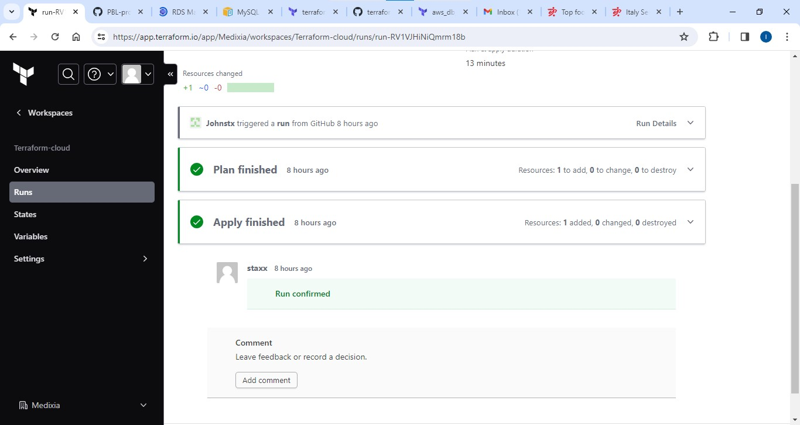
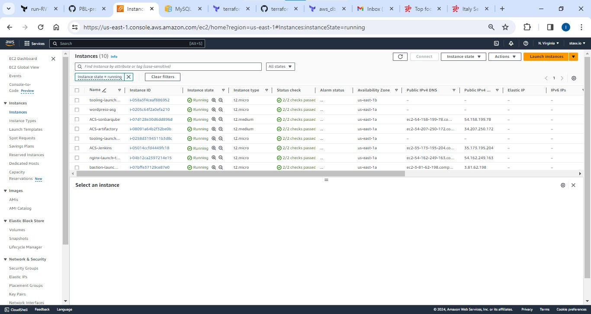

### AWS Cloud Solution For 2 Company Websites Using A Reverse Proxy Technology - Set up of IAC using Terraform.


.png>)

Key Actions for this Project - 
1. AWS VPC network is used to set up the company's I.T infrastructure. Which includes - 
    * A main business website based on Wordpress CMS.
    * A tooling Website for the DevOps team.
    * A reverse Proxy for improved security & performance. NGINX.

2. Automation of the infrastructure with IAC using Terraform cloud.


3. Install graphviz 
``` sudo apt install graphviz ```
**Graphviz** is an open-source graph visualization software that allows you to represent structural information as diagrams of abstract graphs and networks. It is commonly used to generate visual representations of data structures, workflows, dependency graphs, and various other complex relationships between entities.

### To generate dependency graph
```
terraform graph -type=plan | dot -Tpng > graph.png
```

```
terraform graph | dot -Tpng > graph.png
```

4. Build images using packer.
-- Packer is an open-source tool developed by HashiCorp that allows you to automate the creation of machine images for multiple platforms from a single configuration. It helps streamline the process of building and distributing consistent, pre-configured images across various environments like AWS, Azure, Google Cloud, VMware, and more.


Terraform Cloud enhances Terraform's capabilities by providing a centralized, secure environment for managing infrastructure at scale. It offers features like remote state management, state locking, collaboration tools, policy enforcement with Sentinel, and automated execution. These features make Terraform Cloud particularly valuable for teams, enabling efficient collaboration, secure management of secrets, and consistent, automated infrastructure deployment across multiple environments. With built-in cost estimation, scalability, and role-based access control, Terraform Cloud simplifies and strengthens infrastructure management for organizations.

Terraform Cloud is a managed service that provides you with Terraform CLI to provision infrastructure, either on demand or in response to various events.

Lets use Terraform Cloud by Migrating our previous project to Terrraform cloud.

### Migrate the .tf codes to Terraform Cloud


1. Create a Terraform cloud account. [Learn more](https://app.terraform.io/signup/account) 

2. Create an organization.
select "start from scratch". Choose  a name for the organization and create.

3. Configure workspace
Using the ``version control workflow``.
A new repo is created on Github, called ``terraform-cloud``
Choose ``version control workflow`` and follow the prompt to connect Github to the workspace.
4. Configure variables - (Environment)
Terraform Cloud supports two types of variables: **environment** variables and **Terraform** variables.

Set two environment variables: 
**AWS_ACCESS_KEY_ID** and 
**AWS_SECRET_ACCESS_KEY**

And set their values with the keys generated during IAM setup. *Highlighted previously*

These credentials are required to authenticate and interact with AWS API/Services

5. Codes from the github repo an be accessed through terraform cloud, this would create the AWS resources manifest in the IAC terrafrom script contained in the github repo. But lets choose our AMIs first.

Add 2 more directories to your project. - 

* **AMI:** for building packer images
* **Ansible:** for Ansible scripts to configure the infrastucture.

Install - 
* [packer](https://learn.hashicorp.com/tutorials/packer/get-started-install-cli)
* [Ansible](https://docs.ansible.com/ansible/latest/installation_guide/intro_installation.html)


Run packer build against AMI configs objects found in this [repo](https://github.com/darey-devops/PBL-project-19.git)




The AMIs are created as per required. The AMI ID's are then copied from the AWS UI and updated in the *.auto.tfvars* file.


6. Run ``terraform plan`` and ``terraform apply`` 
Switch to "Runs" tab and click on "Queue plan manualy" button. If planning has been successfull, you can proceed and confirm Apply - press "Confirm and apply", provide a comment and "Confirm plan".
Check the logs and verify that everything has run correctly. Note that Terraform Cloud has generated a unique state version that you can open and see the codes applied and the changes made since the last run.






Oberserve the resources and ensure it suits the desired plan.


This setup has provsioned the architecture required for the business sites.

Now we have to set up the deploy the the requirements in the servers so that the business logic can commence. Here we use 
**ansible**.

In the **Ansible Roles** directory:-
* Update the **tooling** and **wordpress** ``../task/setup-db.yml`` with the **AWS RDS endpoint** provisioned. *seen in the AWS RDS UI*

* Update the ``../task/main.yml`` for the Tooling & Wordpress roles with the file system ID ``fs`` and accesspoint ``fsap``, from the **EFS** resource in **AWS**

* Update the ansible script with the internal load balancer DNS for Nginx reverse proxy (**nginx.con.j2 file**).


*Ensure database credentials are accurate*.

Run the ``ansible playbook``


Go through the websites and ensure access is successful.


END.


#### This project has depoyed two custom websites for a business enterprise, using the following programs/tools-  
* AWS cloud services.
    * EFS - File share
    * RDS - Database
    * S3 bucket -Storage / Terraform backend 
* Terraform cloud
* Terraform IAC with its features like terraform modules
* Packer and Ansible to configure an AWS architecture to setup.
* NGINX as a reverse proxy.
