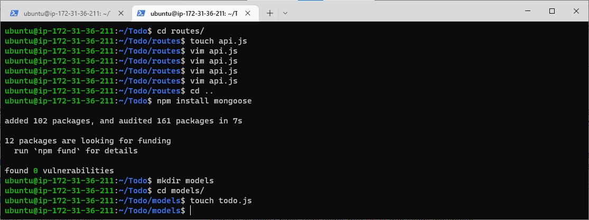
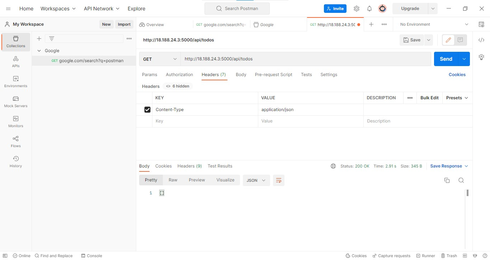

## ---------MERN STACK IMPLEMENTATION -----------------

### CREATING A SIMPLE TO-DO APPLICATION USING MERN WEB STACK


MERN web stack consist of the the following components -

1. [**M**ongoDB](https://www.mongodb.com/docs/manual/installation/ "MongoDB"): A document-based, No-SQL database used to store application data in a form of documents.
2. [**E**xpressJS](https://expressjs.com/en/starter/installing.html "expressjs"): A server side Web Application framework for Node.js.
3. [**R**eactJS](https://reactjs.org/ "Reactjs"): A frontend framework developed by facebook. It is based on JavaScript, used to build user interface (UI) components.
4. [**N**ode.js](https://nodejs.org/en/ "nodejs"): A Javascript runtime environment. It is used to run Javascript on a machine rather than in  a browser.

A user interacts with the ReactJS UI components at the application front-end residing in the browser. This frontend is served by the application backend residing in a server, through ExpressJS running on top of NodeJS.

Any interaction that causes a data change request is sent to the NodeJS based Express server, which grabs data from the MongoDB database if required, and returns the data to the frontend of the application, which is then presented to the user.

#### Log into AWS and Create an EC2 running on Ubuntu OS as previously done

## BACKEND CONFIGURATION

Update ubuntu

``` sudo apt update ```

Upgrade ubuntu

``` sudo apt upgrade ```


Get the location of Node.js software from Ubuntu repositories.

``` 
curl -fsSL https://deb.nodesource.com/setup_18.x | sudo -E bash -
```


### **Install Node.js on the server**

Install Node.js with the command below

``` sudo apt-get install -y nodejs ```


**NB** The command above installs both nodejs and npm. NPM is a package manager for Node like apt for Ubuntu, it is used to install Node modules & packages and to manage dependency conflicts.

Then, Verify the node installation with the command below

``` node -v ```

Verify the node installation with the command below

``` npm -v ```


### **Application Code Setup**

Create a new directory for your To-Do Project:

```
mkdir Todo
 ```

Run ``ls`` to verify that the direcory is created successfully

``ls``

Change directory to the newly created directory

```
cd Todo
```

Next, use the command ``npm init`` to initialise your project, so that a new file named ``package.json`` will be created. This file will normally contain information about your application and the dependencies that it needs to run. Follow the prompts after running the command. You can press ``Enter`` several times to accept default values, then accept to write out the ``package.json`` file by typing ``yes``.

```
npm init
```


Run the ``ls`` command to verify that you have created the ``package.json`` file.


Next, we will Install [**ExpressJs**](https://expressjs.com/en/starter/installing.html "ExpressJs") and create the **Routes** directory.

## INSTALL EXPRESSJS

Install express using npm:

``npm install express``


Create a file **index.js** with the command below:

``touch index.js``

Run **ls** to confirm that index file is created.

Install the **dotenv** module

`` npm install dotenv ``


Open the index.js file with the ``vim`` command

`` vim index.js ``

Paste the code below into the file:

```
const express = require('express');
require('dotenv').config();

const app = express();

const port = process.env.PORT || 5000;

app.use((req, res, next) => {
res.header("Access-Control-Allow-Origin", "\*");
res.header("Access-Control-Allow-Headers", "Origin, X-Requested-With, Content-Type, Accept");
next();
});

app.use((req, res, next) => {
res.send('Welcome to Express');
});

app.listen(port, () => {
console.log(`Server running on port ${port}`)
});
```

Use **:w** to save in vim and use **:qa** to exit vim

Now it is time to start our server to see if it works. Open your terminal in the same directory as your index.js file and type:

Start the server to see if it work. Open your terminal in the same directory as your index.js file and type:

```
node index.js
```


If every thing goes well, you should see **Server running on port 5000** in your terminal.

Now we need to open this port in EC2 Security Groups same way we did in Project 1. In this case, open the port 5000

Open up your browser and try to access your server’s Public IP or Public DNS name followed by port 5000:

```
http:/<PublicIP-or-PublicDNS>:5000 
```

**Routes**
There are three actions that our To-Do application needs to be able to do:

Create a new task
Display list of all tasks
Delete a completed task
Each task will be associated with some particular endpoint and will use different standard [HTTP request methods](https://developer.mozilla.org/en-US/docs/Web/HTTP/Methods): POST, GET, DELETE.

For each task, we need to create [routes](https://expressjs.com/en/guide/routing.html) that will define various endpoints that the To-do app will depend on. So let us create a folder **routes**

**mkdir routes**


Change directory to routes folder

``cd routes``

then, create a file api.js with the command below

``touch api.js``

Open the file with the command below

``vim api.js``


Copy the code below and paste in the file

```
const express = require ('express');
const router = express.Router();

router.get('/todos', (req, res, next) => {

});

router.post('/todos', (req, res, next) => {

});

router.delete('/todos/:id', (req, res, next) => {

})

module.exports = router;

```

Now create `` models `` directory.

## CREATE MODELS DIRECTORY

A model is at the heart of JavaScript based applications, and it is what makes it interactive. We will also use models to define the database schema. Schema is a blueprint of how the database will be constructed, including other data fields that may not be required to be stored in the database.

To create a Schema and a model, install mongoose which is a Node.js package that makes working with mongodb easier.

``cd`` into Todo directory and install mongoose

Install mongoose

```
npm install mongoose 
```

Create a **models** folder

```
mkdir models
```

``cd`` into the new **models** directory and create a file named **todo.js**

```
cd models
```

then,

```
touch todo.js
```


**NB** All three steps can be achieved in a single command viz:

``mkdir models && cd models && touch todo.js``

Open **todo.js** and paste the code below into it

```
const mongoose = require('mongoose');
const Schema = mongoose.Schema;

//create schema for todo
const TodoSchema = new Schema({
action: {
type: String,
required: [true, 'The todo text field is required']
}
})

//create model for todo
const Todo = mongoose.model('todo', TodoSchema);

module.exports = Todo;

```

Now we need to update our routes from the file api.js in ‘routes’ directory to make use of the new model.

In Routes directory, open api.js with vim api.js, delete the code inside with :%d command and paste the code below into it then save and exit

```
const express = require ('express');
const router = express.Router();
const Todo = require('../models/todo');

router.get('/todos', (req, res, next) => {

//this will return all the data, exposing only the id and action field to the client
Todo.find({}, 'action')
.then(data => res.json(data))
.catch(next)
});

router.post('/todos', (req, res, next) => {
if(req.body.action){
Todo.create(req.body)
.then(data => res.json(data))
.catch(next)
}else {
res.json({
error: "The input field is empty"
})
}
});

router.delete('/todos/:id', (req, res, next) => {
Todo.findOneAndDelete({"_id": req.params.id})
.then(data => res.json(data))
.catch(next)
})

module.exports = router;
```

## MongoDB Database

A database for data storage

We will make use of [mLab](https://www.mongodb.com/atlas-signup-from-mlab) - A mongoDB service provider.

Allow access to the MongoDB database from anywhere (Not secure, but it is ideal for testing)

Create a MongoDB database and collection inisde mLab -


Then, Choose **add my own data** option.

In the **index.js** file, we specified **process.env** to access environment variables, but we have not yet created this file. So we need to do that now.

Create a file in your Todo directory and name it **.env**.

```
touch .env
vi .env
```

Add the connection string to access the database in it -

```
DB= 'mongodb+srv://<username>:<password>@<network-address>/<dbname>?retryWrites=true&w=majority'
```

Ensure to update <username>, <password>, <network-address> and <database> according to your setup

**NB** In this project, I created a custom connection variables -


Here is how to get connection string.


Click "connect your application"> "select node.js" driver> copy the connection string that appears below on the page.

Now, we need to update the **index.js** file to reflect the use of .env so that Node.js cam connect to the database.

Simply delete existing content in the file, update it with the entire code below.
To do that using **vim**, follow below steps

Open the file with vim index.js
Press esc
Type :
Type %d
Hit ‘Enter’
The entire content will be deleted, then,

Press i to enter the insert mode in vim
Now, paste the entire code below in the file.

```
const express = require('express');
const bodyParser = require('body-parser');
const mongoose = require('mongoose');
const routes = require('./routes/api');
const path = require('path');
require('dotenv').config();

const app = express();

const port = process.env.PORT || 5000;

//connect to the database
mongoose.connect(process.env.DB, { useNewUrlParser: true, useUnifiedTopology: true })
.then(() => console.log(`Database connected successfully`))
.catch(err => console.log(err));

//since mongoose promise is depreciated, we overide it with node's promise
mongoose.Promise = global.Promise;

app.use((req, res, next) => {
res.header("Access-Control-Allow-Origin", "\*");
res.header("Access-Control-Allow-Headers", "Origin, X-Requested-With, Content-Type, Accept");
next();
});

app.use(bodyParser.json());

app.use('/api', routes);

app.use((err, req, res, next) => {
console.log(err);
next();
});

app.listen(port, () => {
console.log(`Server running on port ${port}`)
});
```

Using environment variables to store information is considered more secure and best practice to separate configuration and secret data from the application, instead of writing connection strings directly inside the index.js application file.

Start your server using the command:

```
 node index.js
```

You shall see a message ‘Database connected successfully’, if so – we have our backend configured. Now we are going to test it.


**Testing Backend Code without Frontend using RESTful API**

So far we have written backend part of our To-Do application, and configured a database, but we do not have a frontend UI yet. We need ReactJS code to achieve that. But during development, we will need a way to test our code using RESTfulL API. Therefore, we will need to make use of some API development client to test our code.

In this project, we will use [Postman](https://www.postman.com/) to test our API.
Click [Install Postman](https://www.postman.com/downloads/) to download and install postman on your machine.

To learn how to perform [CRUD operations](https://en.wikipedia.org/wiki/Create,_read,_update_and_delete) on Postman, Click [HERE](https://www.youtube.com/watch?v=FjgYtQK_zLE)

You should test all the API endpoints and make sure they are working. For the endpoints that require body, you should send JSON back with the necessary fields since it’s what we setup in our code

Now, Open your Postman, create a POST request to the API
**<http://<PublicIP-or-PublicDNS>:5000/api/todos>**. This request sends a new task to our To-Do list so the application could store it in the database.

**Note:** make sure your set header key Content-Type as application/json


Create a GET request to your API on <http://<PublicIP-or-PublicDNS>:5000/api/todos>. This request retrieves all existing records from out To-do application (backend requests these records from the database and sends it us back as a response to GET request).

**Optional task:** Try to figure out how to send a DELETE request to delete a task from out To-Do list.

**Hint:** To delete a task – you need to send its ID as a part of DELETE request.

By now you have tested backend part of our To-Do application and have made sure that it supports all three operations we wanted:

* [*] Display a list of tasks – HTTP GET request
* [*] Add a new task to the list – HTTP POST request
* [*] Delete an existing task from the list – HTTP DELETE request

We have successfully created our Backend, now let go create the Frontend.

## FRONTEND CREATION

Since we are done with the functionality we want from our backend and API, it is time to create a user interface for a Web client (browser) to interact with the application via API. To start out with the frontend of the To-do app, we will use the **create-react-app** command to scaffold our app.

In the same root directory as your backend code, which is the Todo directory, run:

```
npx create-react-app client
```

This will create a new folder in your **Todo** directory called **client**, where you will add all the react code

### **Running a React App**

Before testing the react app, there are some dependencies that need to be installed.

1. Install [concurrently](https://www.npmjs.com/package/concurrently). It is used to run more than one command simultaneously from the same terminal window.

```
npm install concurrently --save-dev
```

2. Install [nodemon](https://www.npmjs.com/package/nodemon). It is used to run and monitor the server. If there is any change in the server code, nodemon will restart it automatically and load the new changes.

```
npm install nodemon --save-dev
```

3. In **Todo** folder, open the **package.json** file. Change the highlghted part of teh below screenshot and replace with the code below.

```
"scripts": {
"start": "node index.js",
"start-watch": "nodemon index.js",
"dev": "concurrently \"npm run start-watch\" \"cd client && npm start\""
},
```


### Configure Proxy in ``package.json``

1. Change directory to 'client'

```
cd client
```

2. Open the ``package.json`` file

```
vi package.json
```

3. Add the key value pair in the package.json file ``"proxy": "http://localhost:5000"``.

The whole purpose of adding the proxy configuration in number 3 above is to make it possible to access the application directly from the browser by simply calling the server url like ``http://localhost:5000`` rather than always including the entire path like ``http://localhost:5000/api/todos``

Now, ensure you are inside the ``Todo`` directory, and simply do:

```
npm run dev
```

Your app should open and start running on ``localhost:3000``

**Important note:** In order to be able to access the application from the Internet you have to open TCP port 3000 on EC2 by adding a new Security Group rule. You already know how to do it.

**Creating your React Components**
One of the advantages of react is that it makes use of components, which are reusable and also makes code modular. For our Todo app, there will be two stateful components and one stateless component.
From your Todo directory run

```
cd client
```

move to the src directory

```
cd src
```

Inside your ``src`` folder create another folder called ``components``

```
mkdir components
```

Move into the components directory with

```
cd components
```

Inside ‘components’ directory create three files ``Input.js``, ``ListTodo.js`` and ``Todo.js``.

```
touch Input.js ListTodo.js Todo.js
```

Open ``Input.js`` file

```
vi Input.js
```

Copy and paste the following

```
import React, { Component } from 'react';
import axios from 'axios';

class Input extends Component {

state = {
action: ""
}

addTodo = () => {
const task = {action: this.state.action}

    if(task.action && task.action.length > 0){
      axios.post('/api/todos', task)
        .then(res => {
          if(res.data){
            this.props.getTodos();
            this.setState({action: ""})
          }
        })
        .catch(err => console.log(err))
    }else {
      console.log('input field required')
    }

}

handleChange = (e) => {
this.setState({
action: e.target.value
})
}

render() {
let { action } = this.state;
return (
<div>
<input type="text" onChange={this.handleChange} value={action} />
<button onClick={this.addTodo}>add todo</button>
</div>
)
}
}

export default Input
```

To make use of [Axios](https://github.com/axios/axios), which is a Promise based HTTP client for the browser and node.js, you need to cd into your client from your terminal and run yarn add axios or npm install axios.

Move to the src folder

```
cd ..
```

Move to clients folder

```
cd ..
```

Install Axios

```
npm install axios
```

```
cd src/components
```


After that open your ``ListTodo.js``

```
vi ListTodo.js
```

in the ``ListTodo.js`` copy and paste the following code

```
import React from 'react';

const ListTodo = ({ todos, deleteTodo }) => {

return (
<ul>
{
todos &&
todos.length > 0 ?
(
todos.map(todo => {
return (
<li key={todo._id} onClick={() => deleteTodo(todo._id)}>{todo.action}</li>
)
})
)
:
(
<li>No todo(s) left</li>
)
}
</ul>
)
}

export default ListTodo
```

In the Todo.js file, write the following code

```
import React, {Component} from 'react';
import axios from 'axios';

import Input from './Input';
import ListTodo from './ListTodo';

class Todo extends Component {

state = {
todos: []
}

componentDidMount(){
this.getTodos();
}

getTodos = () => {
axios.get('/api/todos')
.then(res => {
if(res.data){
this.setState({
todos: res.data
})
}
})
.catch(err => console.log(err))
}

deleteTodo = (id) => {

    axios.delete(`/api/todos/${id}`)
      .then(res => {
        if(res.data){
          this.getTodos()
        }
      })
      .catch(err => console.log(err))

}

render() {
let { todos } = this.state;

    return(
      <div>
        <h1>My Todo(s)</h1>
        <Input getTodos={this.getTodos}/>
        <ListTodo todos={todos} deleteTodo={this.deleteTodo}/>
      </div>
    )

}
}

export default Todo;
```

We need to make little adjustment to our react code. Delete the logo and adjust our App.js to look like this.

Move to the src folder

```
cd ..
```

Make sure that you are in the src folder and run

```
vi App.js
```

Copy and paste the code below into it

```
import React from 'react';

import Todo from './components/Todo';
import './App.css';

const App = () => {
return (
<div className="App">
<Todo />
</div>
);
}

export default App;
```

After pasting the code, exit the editor.

In the src directory open the **App.css**

```
vi App.css
```

Paste the code below into **App.css**

```
.App {
text-align: center;
font-size: calc(10px + 2vmin);
width: 60%;
margin-left: auto;
margin-right: auto;
}

input {
height: 40px;
width: 50%;
border: none;
border-bottom: 2px #101113 solid;
background: none;
font-size: 1.5rem;
color: #787a80;
}

input:focus {
outline: none;
}

button {
width: 25%;
height: 45px;
border: none;
margin-left: 10px;
font-size: 25px;
background: #101113;
border-radius: 5px;
color: #787a80;
cursor: pointer;
}

button:focus {
outline: none;
}

ul {
list-style: none;
text-align: left;
padding: 15px;
background: #171a1f;
border-radius: 5px;
}

li {
padding: 15px;
font-size: 1.5rem;
margin-bottom: 15px;
background: #282c34;
border-radius: 5px;
overflow-wrap: break-word;
cursor: pointer;
}

@media only screen and (min-width: 300px) {
.App {
width: 80%;
}

input {
width: 100%
}

button {
width: 100%;
margin-top: 15px;
margin-left: 0;
}
}

@media only screen and (min-width: 640px) {
.App {
width: 60%;
}

input {
width: 50%;
}

button {
width: 30%;
margin-left: 10px;
margin-top: 0;
}
}

```

Exit

In the **src** directory, open the **index.css**

```
vim index.css
```

Paste the code below into it

```
body {
margin: 0;
padding: 0;
font-family: -apple-system, BlinkMacSystemFont, "Segoe UI", "Roboto", "Oxygen",
"Ubuntu", "Cantarell", "Fira Sans", "Droid Sans", "Helvetica Neue",
sans-serif;
-webkit-font-smoothing: antialiased;
-moz-osx-font-smoothing: grayscale;
box-sizing: border-box;
background-color: #282c34;
color: #787a80;
}

code {
font-family: source-code-pro, Menlo, Monaco, Consolas, "Courier New",
monospace;
}
```

Go to the Todo directory

```
cd ../..
```

In the Todo directory, run

```
npm run dev
```

Assuming no errors when saving all these files, our To-Do app should be ready and fully functional with the functionality discussed earlier: creating a task, deleting a task and viewing all your tasks.


We have created a Simple To-Do app and deployed it to MERN stack.
A frontend application created using React.js that communicates with backend application written using Expressjs. A Mongodb backend storing tasks in a database.


### Thank you