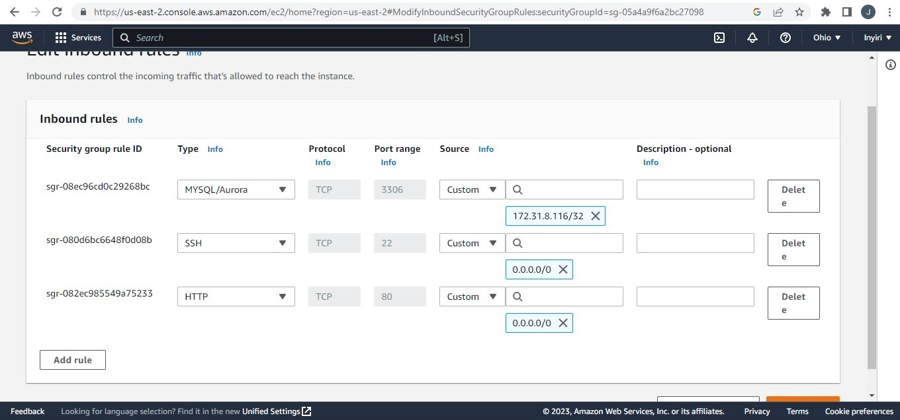

### PROJECT 5

IMPLEMENT A CLIENT SERVER ARCHITECTURE USING MYSQL DATABASE MANAGEMENT SYSTEM (DBMS)

Here the task is implementing a client-server architecture using mysql database management system.

STEPS

1 Create and configure two Linux-based virtual servers (EC2 instances in AWS).

 - server A is named 'mysql-server'
 - server B is named 'mysql-client'

2 Install mysql **server** software on the `mysql-server` linux server

 ```
  sudo apt install mysql-server -y
 ```

Enable the mysql service
 
```
sudo systemctl enable mysql -y
```

  OUTPUT
  
  
3 Install mysql client software on the `mysql-client` linux server

```
sudo apt install mysql-client -y 
``` 


Since both of the instances are located on same local virtual network, they will communicate with each other using local IP addresses.
mysql-server's IP will be used to connect from mysql-client.
By default mysql servers use PORT 3306. So an inbound rule is set on mysql-server's security group opening the PORT 3306 to enable connection from a client. While this port is opened, traffic from all clients will not allowed for security reasons. only traffic from 'msql-client's IP' is allowed/set.



4 Run the mysql interactive script

```
sudo mysql_secure_installation
``` 


5 Run mysql command to log in and create user

```
sudo mysql
``` 


6   Configure the mysql server to allow connection from remote hosts.

```
 sudo vi /etc/mysql/mysql.conf.d/mysqld.cnf 
```


7 From the `mysql client`, remotely connect to the `mysql server` database engine without ssh.
```
sudo mysql -u remote_user -h 172.31.1.104 -p
``` 


8 Show successful connectrion to the remote `mysql server` and perform some queries.
run ```show databases```
then exit.


Output above shows successful remote connection from the `mysql client` to `mysql server` database. 

Thank you. 

Job done!