## PROJECT 6

### CONFIGURING A STORAGE INFRASTRUCTURE ON TWO LINUX SERVERS AND IMPLEMENTING WEB SOLUTION USING WORDPRESS

KEY STEPS TO CARRY OUT -

1 CONFIGURE STORAGE FOR THE SERVERS (WEB AND DATABASE).

2 INSTALL WORDPRESS AND CONNECT TO REMOTE MYSQL DATABASE SERVER.

 > *redhat* OS will be used for this task.

---

### STEP 1

1. Launch an EC2 instance and name it "Webserver".
Create 3 volumes in the same AZ as `webserver`. Each volume will have size of 10gb.
Attach all 3 volumes in succession to `webserver` EC2 instance.


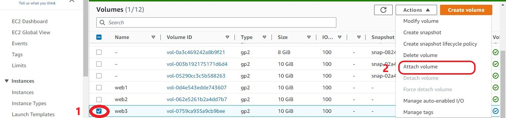

To learn how to add volume to an EC2 instance, click [here](https://www.youtube.com/watch?v=HPXnXkBzIHw)

2. Go to the Linux terminal to begin the configuration
    * Run ``` lsblk ``` to inspect block devices attached to the server ``webserver``.

     __NB__: Notice names of newly created devices.

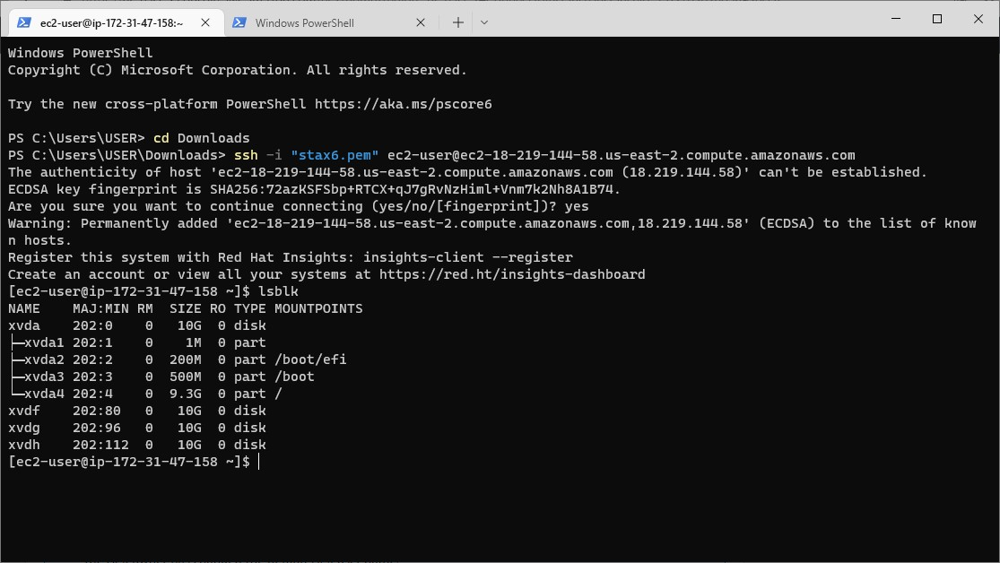

    All devices in linux reside in __/dev/__ directory. Use __ls /dev/__ to inspect them.


3. Run ```df -h``` command to see all mounts and free space on the server.


4. Run ```gdisk``` command to create a single partition on each of the 3 disks.

    ```
    sudo gdisk /dev/xvdf
    ```


5. Run ```lsblk``` to view newly configured partition on each of the 3 disks.


6. Install ``lvm`` package using __yum__

    ```
    sudo yum install lvm2 -y


Run lvmdiskscan utility to check for available partition

```
sudo lvmdiskscan
```


7. Create Physical volumes to be used by LVM - Use ```pvcreate```  to mark each of the 3 disks as physical volumes.


Verify physical volumes are succesfully created by running

```
 sudo pvs
```

8. Add all 3 PVs to a Volume Group (VG) -  Use ``vgcreate`` for this

```
sudo vgcreate webdata-vg /dev/xvdf1 /dev/xvdg1 /dev/xvdh1
```


To verify above is successful, run the ``vgs`` command  -

```
sudo vgs
```

9. Create 2 Logical Volumes (LV) using ``lvcreate``.
     * __apps-lv__ (use half of the PV size) and
     * __logs-lv__ (use the remaining size of the PV).

     > Website data is stored in __apps-lv__ while data for logs is stored in __logs-lv__

```
sudo lvcreate -n apps-lv -L 14G webdata-vg
```

```
sudo lvcreate -n logs-lv -L 14G webdata-vg
```


To verify successful implementation - use lvs

```
sudo lvs
```


10. Verify the setup by running the command below -

```
sudo vgdisplay -v #view complete setup - VG, PV, and LV
```


11. Use ```mkfs.ext4``` to format the logical volumes with __ext4__ filesystem

```
sudo mkfs -t ext4 /dev/webdata-vg/apps-lv
sudo mkfs -t ext4 /dev/webdata-vg/logs-lv
```

12. Create __/var/www/html__ directory to store website files

    ```
    sudo mkdir -p /var/www/html 
    ```

13. Create __/home/recovery/logs__ to store backup of log data.

    ```
    sudo mkdir -p /home/recovery/logs
    ```

14. Mount __/var/www/html__ on __apps-lv__ logical volume

    ```
    sudo mount /dev/webdata-vg/apps-lv /var/www/html/
    ```


15. Use ``rsync`` utility to backup all the files in the __/var/log__ directory to the /home/recovery/logs (required before mounting the system)

    ```
    sudo rsync -av /var/log/. /home/recovery/logs/
    ```

16. Mount __/var/log__ on the logs-lv logical volume. (__NB__ All existing data on __/var/log__ will be deleted in the process, thats why the back up on step 15 above is necessary)

    ```
    sudo mount /dev/webdata-vg/logs-lv /var/log
    ```

17. Restore log files back into __/var/log directory__

    ```
    sudo rsync -av /home/recovery/logs/. /var/log
    ```

### UPDATE THE /ETC/FSTAB FILE

18. Update the ``/etc/fstab``  so that the mount configuration will persist after restart of the server.

The UUID of the device will be used to update the /etc/fstab file;
To obtain the UUID, run ``sudo blkid``

```
sudo blkid
```

Then open the /etc/fstab file -

```
sudo vi /etc/fstab
```

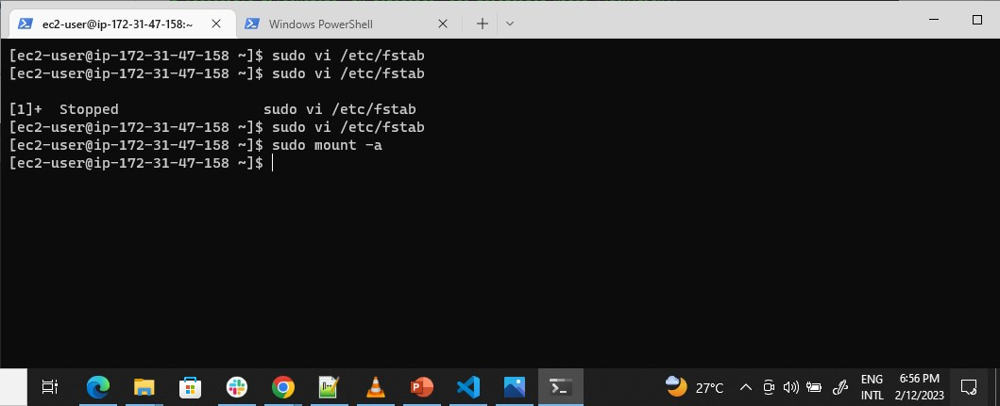

update the file in the format below using unique UUID. Remove the leading and ending quotes


19. Test the configuration and reload the daemon

    ```
    sudo mount -a
    sudo systemctl daemon-reload
    ```


20. Verify the setup by running `` df -h ``, output should look like this:


---

## Step 2

## Launch an EC2 instance for the Database server

1. Launch an EC2 instance and name it "database server".
Create 3 volumes in the same AZ as `database server` as we did earlier for the webserver. Each volume will have size of 10gb.
Attach all 3 volumes in succession to `database server` EC2 instance using the same method as above.

All steps in ``web server`` is repeated (partitioning, lvm etc) but instead of ``app-lv``, ``db-lv`` is created and mounted to the ``/db`` directory instead of the ``/var/www/html/``.

2. Run ``lsblk`` to inspect block devices attached to the server

3. Run ``df -h`` to see all mounts in server

4. Run ``gdisk`` to create a partition on each of the disks
    ``lsblk`` to view the new partitions

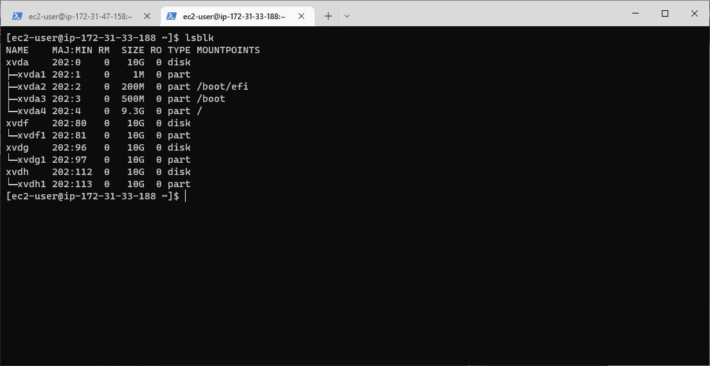

5. Run ``pvcreate``, ``vgcreate`` and ``lvcreate`` utilities as done prevously.

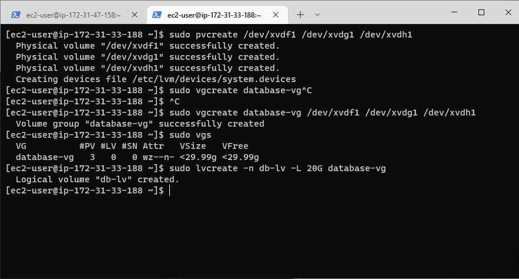

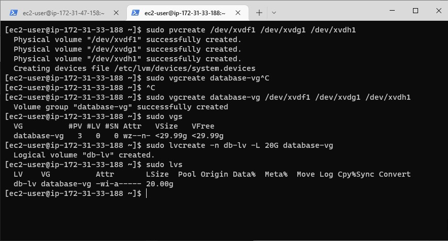

Now the __Logical Volume__ , ``db-lv`` is created.
Create a __db__ directory
Format the ``db-lv`` with ``mkfs.ext4``
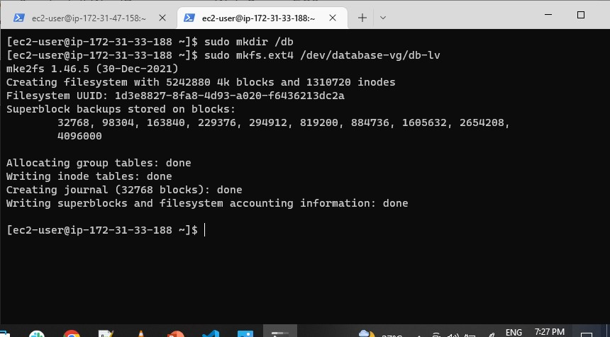

6. Mount the logical volume to ``/db`` directory

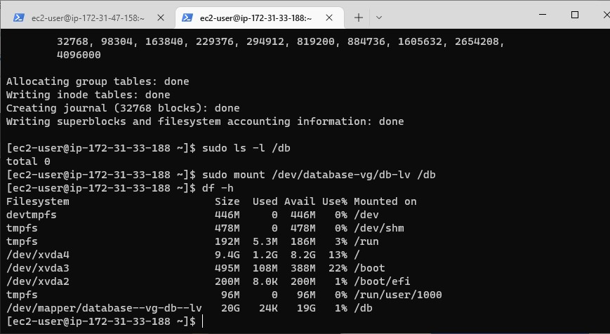

## Update the /etc/fstab

Run ``blkid`` then open and edit the ``/etc/fstab``

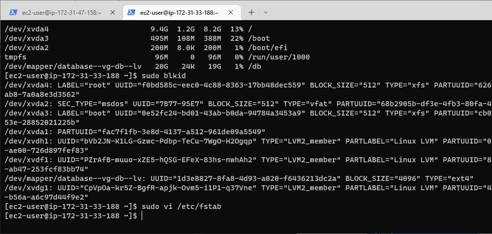

``/etc/fstab`` was edited using the UUID from the ``blkid`` output

7. Test the configuration and reload the daemon

    ```
    sudo mount -a
    sudo systemctl daemon-reload
    ```


---

### Next is STEP 3. 
LETS INSTALL WORDPRESS ON THE WEBSERVER

## STEP 3 - WORDPRESS INSTALL IN WEBSERVER

1. ### On the ``webserver`` linux instance, update the the repository.

```
sudo yum -y update
```

2. ### Install ```wget```, ```Apache``` and it’s dependencies

```
sudo yum -y install wget httpd php php-mysqlnd php-fpm php-json
```


* Start Apache

```
sudo systemctl enable httpd
sudo systemctl start httpd
```

3. ### To install PHP and it’s dependencies

```
sudo yum install https://dl.fedoraproject.org/pub/epel/epel-release-latest-8.noarch.rpm
sudo yum install yum-utils http://rpms.remirepo.net/enterprise/remi-release-8.rpm
sudo yum module list php
sudo yum module reset php
sudo yum module enable php:remi-7.4
sudo yum install php php-opcache php-gd php-curl php-mysqlnd
sudo systemctl start php-fpm
sudo systemctl enable php-fpm
setsebool -P httpd_execmem 1
```


4. ### Restart Apache

```
sudo systemctl restart httpd
```

5. ###  Download Wordpress and copy wordpress to /var/www/html

Here we create a directory ``wordpress``, download __wordpress__ zip file in it and extract into this same ``wordpress`` directory. Now we have an extracted folder which is also named wordpress (since its basically the target file we downloaded), this folder is seen when you ``ls -l`` into the first ``wordpress`` directory created.

You have to ``cd`` into this second ``wordpress`` to find a list of files, including a `` wp-config-sample.php ``, then follow the steps below. 

```
  mkdir wordpress
  cd   wordpress
  sudo wget http://wordpress.org/latest.tar.gz
  sudo tar xzvf latest.tar.gz
  sudo rm -rf latest.tar.gz
  cp wordpress/wp-config-sample.php wordpress/wp-config.php
  cp -R wordpress /var/www/html/
```

OUTPUT


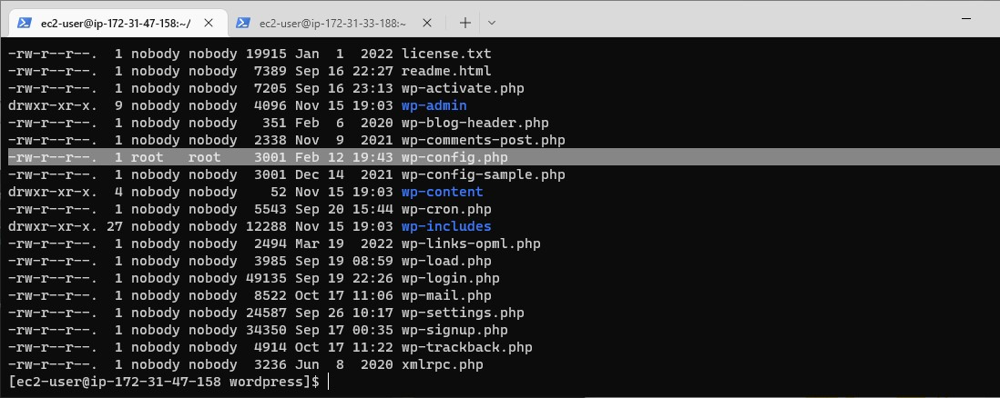

6.  ### Configure SELinux Policies

```
  sudo chown -R apache:apache /var/www/html/wordpress
  sudo chcon -t httpd_sys_rw_content_t /var/www/html/wordpress -R
  sudo setsebool -P httpd_can_network_connect=1
```
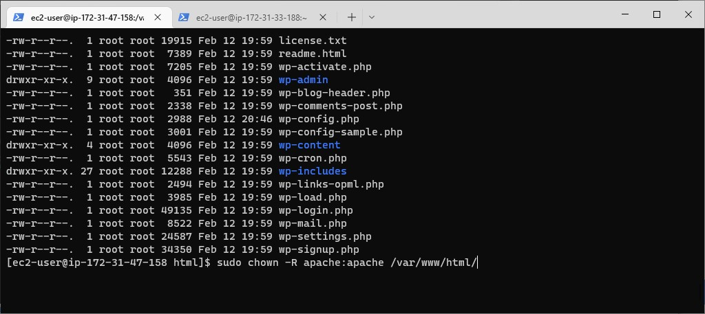


---

## Step 4 — Install MySQL on DB Server EC2

```
sudo yum update
sudo yum install mysql-server
``` 

Verify that the service is up and running by using ``` sudo systemctl status mysqld ``` , if it is not running, restart the service and enable it so it will be running even after reboot:

```
sudo systemctl restart mysqld
sudo systemctl enable mysqld
``` 


---

## Step 5 — Configure DB to work with WordPress


```
sudo mysql
CREATE DATABASE wordpress;
CREATE USER `myuser`@`<Web-Server-Private-IP-Address>` IDENTIFIED BY 'mypass';
GRANT ALL ON wordpress.* TO 'myuser'@'<Web-Server-Private-IP-Address>';
FLUSH PRIVILEGES;
SHOW DATABASES;
exit
``` 


## Step 6 - Configure Wordpress to connect to remote database.

Hint: Do not forget to open MySQL port 3306 on DB Server EC2. For extra security, you shall allow access to the DB server ONLY from your Web Server’s IP address, so in the Inbound Rule configuration specify source as /32

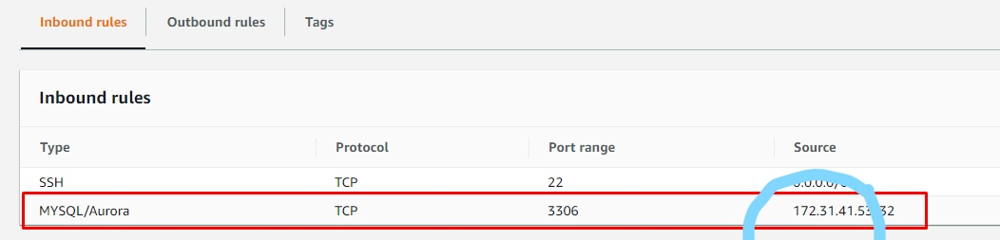

1. Install MySQL client and test connection from the Web server to the DB server using ``` mysql-client```

```
sudo yum install mysql
sudo mysql -u admin -p -h <DB-Server-Private-IP-address>
```
2. verify ``` SHOW DATABASES; ``` command can run, when it runs you will see a list of existing databases.

3. Change permissions and configuration so Apache could use WordPress.
4. Enable TCP port 80 in Inbound Rules configuration for your Web Server EC2 (enable from everywhere 0.0.0.0/0 or from your workstation’s IP).

5. Try to access from your browser the link to your WordPress http://<Web-Server-Public-IP-Address>/wordpress/


This shows that wordpress has been successfully installed.
We have just learned to configure Linux storage subsystem and have deployed a full-scale web solution using wordpress CMS and MySQL RDBMS.