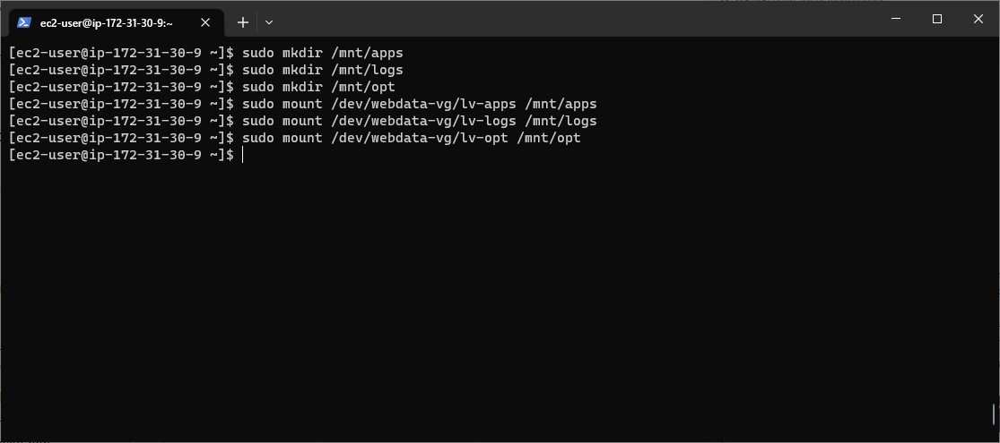
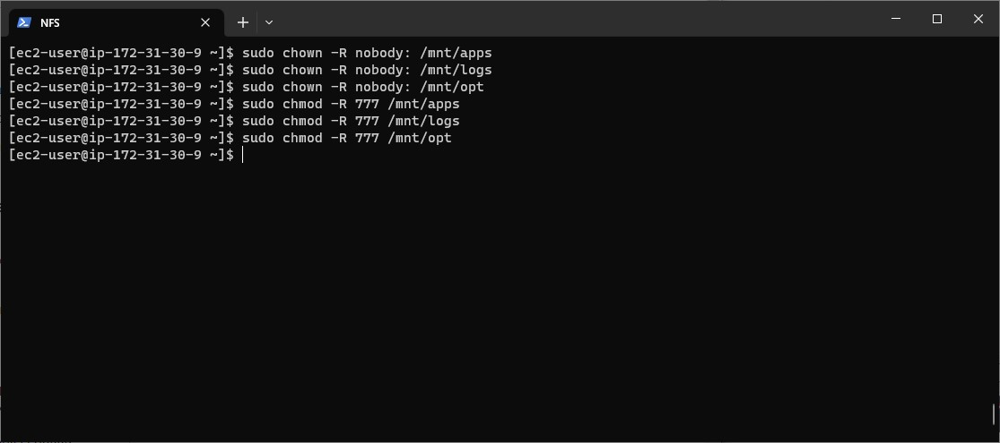
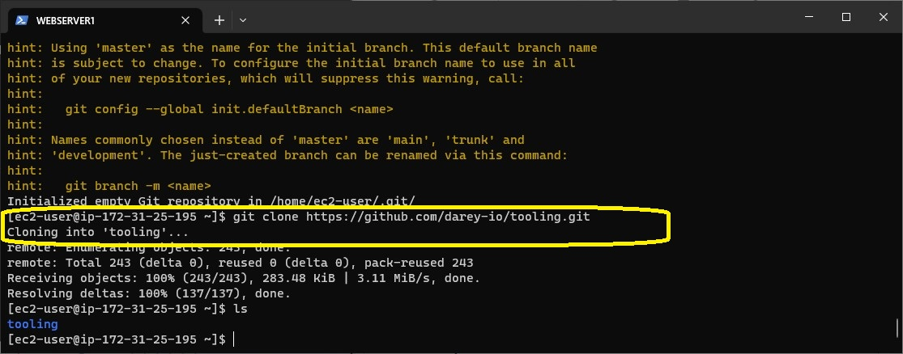
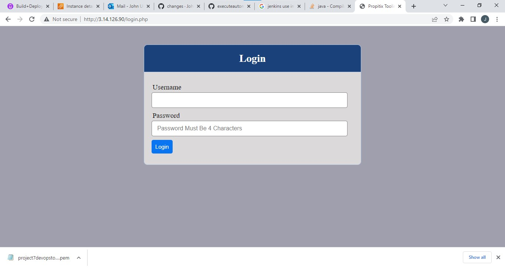
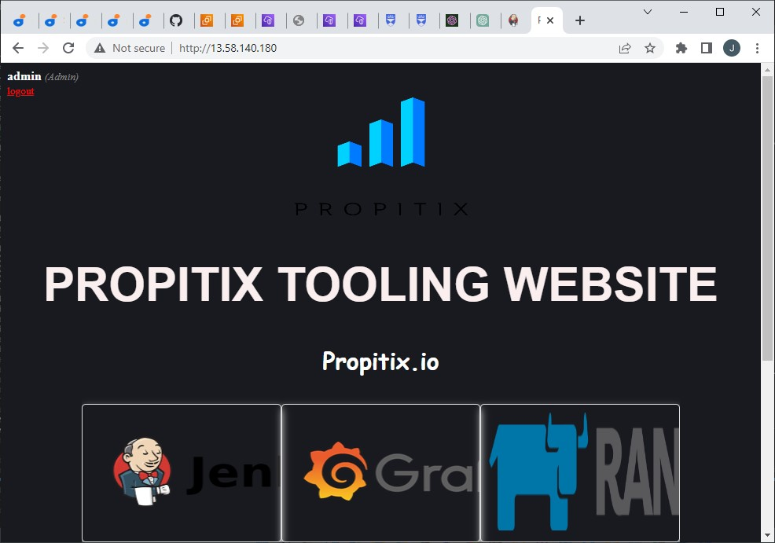
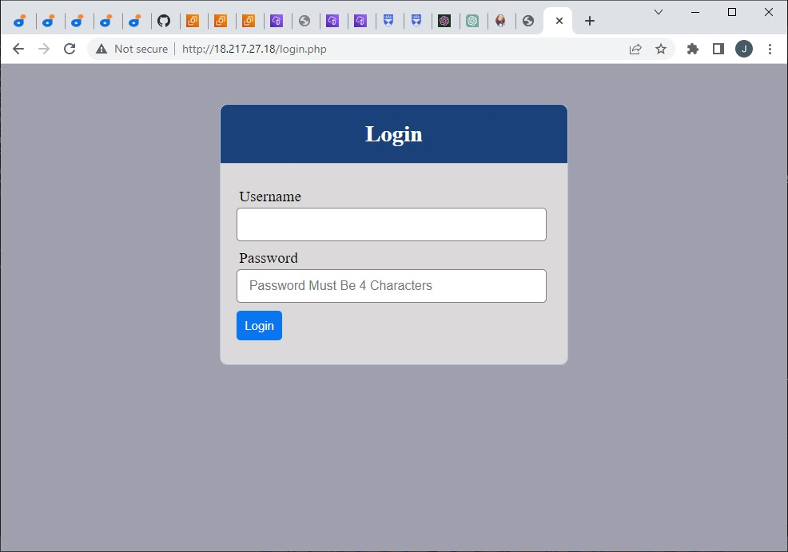
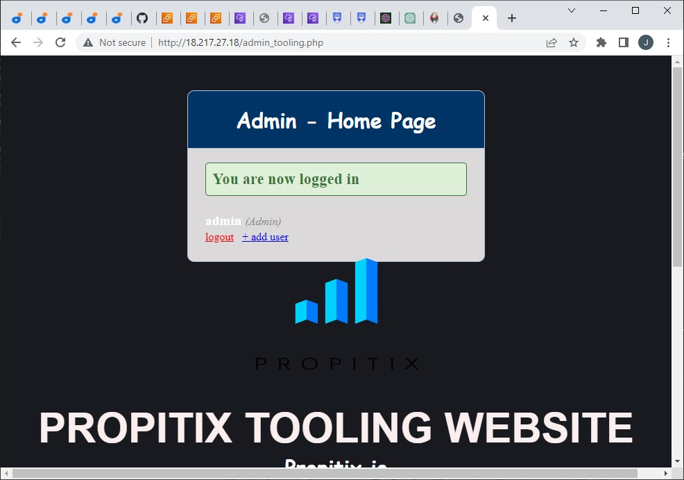

#### PREPARE NFS SERVER

##### STEP 1 - PREPARE NFS SERVER

1. Launch a new EC2 instance using RHEL linux 8 OS
2. Configure LVM on the server using previous method


3. 
    * Format the disks as ```xfs``` instead of ```ext4```
    * Ensure there are 3 Logical Volumes. lv-opt         lv-apps, and lv-logs
    * Create mount points on /mnt directory for the logical volumes as follow:
    Mount lv-apps on /mnt/apps – To be used by webservers
    Mount lv-logs on /mnt/logs – To be used by webserver logs
    Mount lv-opt on /mnt/opt – To be used by Jenkins server in a later task.




4. Install NFS server, configure it to start on reboot and make sure it is u and running

```
sudo yum -y update
sudo yum install nfs-utils -y
sudo systemctl start nfs-server.service
sudo systemctl enable nfs-server.service
sudo systemctl status nfs-server.service
```


5. Export the mounts for webservers’ subnet cidr to connect as clients. For simplicity, you will install your all three Web Servers inside the same subnet, but in production set up you would probably want to separate each tier inside its own subnet for higher level of security.
To check your subnet cidr – open your EC2 details in AWS web console and locate ‘Networking’ tab and open a Subnet link

## Ensure to set up permission that will allow our web servers to read, write and execute files on NFS.

```
sudo chown -R nobody: /mnt/apps
sudo chown -R nobody: /mnt/logs
sudo chown -R nobody: /mnt/opt

sudo chmod -R 777 /mnt/apps
sudo chmod -R 777 /mnt/logs
sudo chmod -R 777 /mnt/opt

sudo systemctl restart nfs-server.service
```



Configure access to NFS for clients within the same subnet (example of Subnet CIDR – 172.31.16.0/20 ):


```
sudo vi /etc/exports

/mnt/apps <Subnet-CIDR>(rw,sync,no_all_squash,no_root_squash)
/mnt/logs <Subnet-CIDR>(rw,sync,no_all_squash,no_root_squash)
/mnt/opt <Subnet-CIDR>(rw,sync,no_all_squash,no_root_squash)

Esc + :wq!

sudo exportfs -arv
```


6. Check which port is used by NFS and open it using Security Groups (add new Inbound Rule)


Check ports, run
```
rpcinfo -p | grep nfs
```


**NB:** In order for NFS server to be accessible from your client, you must also open following ports: TCP 111, UDP 111, UDP 2049

##### STEP 5 - CONFIGURE THE DATABASE SERVER

Here, simply install and configure a MySQL DBMS to work with remote web server.

1. Install MySQL server.
2. Create a database and name it `` tooling ``
3. Create a database user and name it `` webaccess `` 
4. Grant permission to ``webaccess`` user on ``tooling`` to do anything, only from the webserver's ``subnet cidr``


##### STEP 3 - PREPARE THE WEB SERVERS

We need to make sure that our Web Servers can serve the same content from shared storage solutions, in our case – NFS Server and MySQL database.
You already know that one DB can be accessed for reads and writes by multiple clients. For storing shared files that our Web Servers will use – we will utilize NFS and mount previously created Logical Volume lv-apps to the folder where Apache stores files to be served to the users (/var/www).

This approach will make our Web Servers stateless, which means we will be able to add new ones or remove them whenever we need, and the integrity of the data (in the database and on NFS) will be preserved.

The idea is to have more than 2 servers access the DB and the its contents.
So we will create 3 webservers.

So we start by the following:
* Configure NFS client (this step must be done on all three servers)
* Deploy a Tooling application to our Web Servers into a shared NFS folder
* Configure the Web Servers to work with a single MySQL database

STEPS:

1. Launch a new EC2 instance with RHEL 8 Operating System
2. Install NFS client
```
sudo yum install nfs-utils nfs4-acl-tools -y
```


3. Mount ``/var/www/`` and target the NFS server’s export for apps

```
sudo mkdir /var/www
sudo mount -t nfs -o rw,nosuid <NFS-Server-Private-IP-Address>:/mnt/apps /var/www
```


4. Verify that NFS was mounted successfully by running ``df -h``. Make sure that the changes will persist on Web Server after reboot:

```
sudo vi /etc/fstab
```
add following line

``` 
<NFS-Server-Private-IP-Address>:/mnt/apps /var/www nfs defaults 0 0
```


5. Install [Remi’s repository](http://www.servermom.org/how-to-enable-remi-repo-on-centos-7-6-and-5/2790/), Apache and PHP

```
sudo yum install httpd -y

sudo dnf install https://dl.fedoraproject.org/pub/epel/epel-release-latest-8.noarch.rpm

sudo dnf install dnf-utils http://rpms.remirepo.net/enterprise/remi-release-8.rpm

sudo dnf module reset php

sudo dnf module enable php:remi-7.4

sudo dnf install php php-opcache php-gd php-curl php-mysqlnd

sudo systemctl start php-fpm

sudo systemctl enable php-fpm

setsebool -P httpd_execmem 1
```

6. Verify that Apache files and directories are available on the Web Server in ``/var/www`` and also on the NFS server in ``/mnt/apps``. If you see the same files – it means NFS is mounted correctly. You can try to create a new file touch ``test.txt`` from one server and check if the same file is accessible from other Web Servers.
 Webserver


NFS

After ``` $ touch testfile ```
 
WEBSERVER


NFS


7. Locate the log folder for Apache on the Web Server and mount it to NFS server’s export for logs. Repeat step №4 to make sure the mount point will persist after reboot.


8. Fork the tooling source code from [Darey.io Github Account](https://github.com/darey-io/tooling) to your Github account. (Learn how to fork a repo [here](https://www.youtube.com/watch?v=f5grYMXbAV0))



9. Deploy the tooling website’s code to the Webserver. Ensure that the **html** folder from the repository is deployed to ``/var/www/html``


**Note 1**: Do not forget to open TCP port 80 on the Web Server, thats the port for apache remember.

**Note 2**: Note 2: If you encounter 403 Error – check permissions to your ``/var/www/html`` folder and also disable SELinux ``sudo setenforce 0``
To make this change permanent – open following config file ``sudo vi /etc/sysconfig/selinux and set SELINUX=disabled`` then restrt httpd. 
:lightbulb: very important


10. Update the website’s configuration to connect to the database (in ``/var/www/html/functions.php`` file). Here update with the DB login credentials - IP, DB name and password.


 `` Apply tooling-db.sql`` script to your database using this command 
`` mysql -h <databse-private-ip> -u <db-username> -p <db-pasword> < tooling-db.sql ``


11. Create in MySQL a new admin user with username: ``myuser`` and password: ``password``

INSERT INTO ‘users’ (‘id’, ‘username’, ‘password’, ’email’, ‘user_type’, ‘status’) VALUES
-> (1, ‘myuser’, ‘5f4dcc3b5aa765d61d8327deb882cf99’, ‘user@mail.com’, ‘admin’, ‘1’); Or any custom values.

12. Open the website in your browser http://<Web-Server-Public-IP-Address-or-Public-DNS-Name>/index.php and make sure you can login into the website with ``myuser user`` or yoour set custom username

Below is the result of our build.




Same steps is repeated for other 2 webservers successfully.

webserver_2 webpage:



webserver_3



Deployment of a web solution for a DevOps team has been achieved successfully using a LAMP STACK with remote database and NFS servers.


