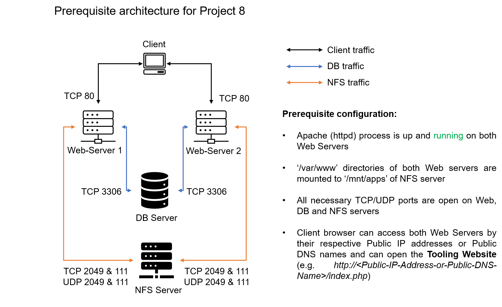

#### PROJECT 8 - LOAD BALANCER SOLUTION WITH APACHE

#### Prerequisites

The following servers installed and configured within Project-7: 

1. Two RHEL8 Web Servers
2. One MySQL DB Server (based on Ubuntu 20.04)
3. One RHEL8 NFS server




#### Task

Deploy and configure an Apache Load Balancer for Tooling Website solution on a separate Ubuntu EC2 intance. Ensure that users can be served by Web servers through the Load Balancer.

To simplify, let us implement this solution with 2 Web Servers, the approach will be the same for 3 and more Web Servers.

#### Step 1 - CONFIGURE APACHE AS A LOAD BALANCER

1. Create an Ubuntu Server 20.04 EC2 instance and name it ``Project-8-apache-lb``, so your EC2 list will look like this:


2. Open TCP port 80 on ``Project-8-apache-lb`` by creating an Inbound Rule in Security Group.


3. Install Apache Load Balancer on ``Project-8-apache-lb`` server and configure it to point traffic coming to LB to both Web Servers:

```
#Install apache2
sudo apt update
sudo apt install apache2 -y
sudo apt-get install libxml2-dev

#Enable following modules:
sudo a2enmod rewrite
sudo a2enmod proxy
sudo a2enmod proxy_balancer
sudo a2enmod proxy_http
sudo a2enmod headers
sudo a2enmod lbmethod_bytraffic

#Restart apache2 service
sudo systemctl restart apache2
```

Make sure apache2 is up and running
```
sudo systemctl status apache2
```

Configure load balancing

```
sudo vi /etc/apache2/sites-available/000-default.conf

#Add this configuration into this section <VirtualHost *:80>  </VirtualHost>

<Proxy "balancer://mycluster">
               BalancerMember http://<WebServer1-Private-IP-Address>:80 loadfactor=5 timeout=1
               BalancerMember http://<WebServer2-Private-IP-Address>:80 loadfactor=5 timeout=1
               ProxySet lbmethod=bytraffic
               # ProxySet lbmethod=byrequests
        </Proxy>

        ProxyPreserveHost On
        ProxyPass / balancer://mycluster/
        ProxyPassReverse / balancer://mycluster/

#Restart apache server

sudo systemctl restart apache2
```


[bytraffic](https://httpd.apache.org/docs/2.4/mod/mod_lbmethod_bytraffic.html) balancing method will distribute incoming load between your Web Servers according to current traffic load. We can control in which proportion the traffic must be distributed by loadfactor parameter.
Other methods include - [bybusyness](https://httpd.apache.org/docs/2.4/mod/mod_lbmethod_bybusyness.html), [byrequests](https://httpd.apache.org/docs/2.4/mod/mod_lbmethod_byrequests.html), [heartbeat](https://httpd.apache.org/docs/2.4/mod/mod_lbmethod_heartbeat.html)

4. To Verify that our configuration works – try to access the LB’s public IP address or Public DNS name from browser:

```
http://<Load-Balancer-Public-IP-Address-or-Public-DNS-Name>/index.php
``` 


**Note**: If in the Project-7 you mounted ``/var/log/httpd/`` from your Web Servers to the NFS server – unmount them and make sure that each Web Server has its own log directory.

Open two ssh/Putty consoles for both Web Servers and run following command:

```
sudo tail -f /var/log/httpd/access_log
```
Try to refresh your browser page ``http://<Load-Balancer-Public-IP-Address-or-Public-DNS-Name>/index.php`` several times and make sure that both servers receive HTTP GET requests from your LB – new records must appear in each server’s log file. The number of requests to each server will be approximately the same since we set ``loadfactor`` to the same value for both servers – it means that traffic will be disctributed evenly between them.

If you have configured everything correctly – your users will not even notice that their requests are served by more than one server.

Read more about different configuration aspects of Apache mod_proxy_balancer module. Understand what sticky session means and when it is used.

Optional Step – Configure Local DNS Names Resolution
Sometimes it is tedious to remember and switch between IP addresses, especially if you have a lot of servers under your management.
What we can do, is to configure local domain name resolution. The easiest way is to use /etc/hosts file, although this approach is not very scalable, but it is very easy to configure and shows the concept well. So let us configure IP address to domain name mapping for our LB.

#Open this file on your LB server
```
sudo vi /etc/hosts


#Add 2 records into this file with Local IP address and arbitrary name for both of your Web Servers

<WebServer1-Private-IP-Address> Web1
<WebServer2-Private-IP-Address> Web2
```
Now you can update your LB config file with those names instead of IP addresses.
```

BalancerMember http://Web1:80 loadfactor=5 timeout=1
BalancerMember http://Web2:80 loadfactor=5 timeout=1
```
You can try to ``curl`` your Web Servers from LB locally ``curl http://Web1`` or ``curl http://Web2`` – it shall work.

Remember, this is only internal configuration and it is also local to your LB server, these names will neither be ‘resolvable’ from other servers internally nor from the Internet.

